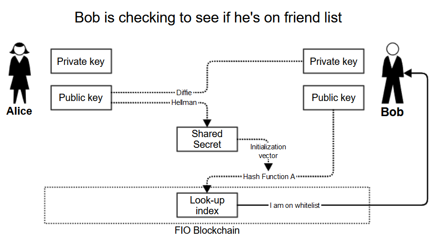

## Abstract

## Terminology
* **Native Blockchain Public Address (NBPA)** - this is the public address on a native blockchain that is needed to send funds and is associated to the FIO Address using [/add_pub_address](https://developers.fioprotocol.io/api/api-spec/reference/add-pub-address/add-pub-address-model)
* **Payee** - is the user receiving funds. In the Send scenario, this is the user who places NBPA on the FIO Chain and allows Payer to see it so that the Payer can send funds using this NBPA. In Request scenario, this is the user sending a FIO Request.
* **Payer** - is the user sending funds using FIO Address. In the Send scenario, Payer will type a FIO Address in wallet, that wallet will look up the corresponding NBPA on native blockchain and transaction will be executed. In Request scenario, Payer will repons to a FIO Request sent by Payee.
* **Sender** - is the user sending a transaction on the FIO Chain to another user (Receiver)
* **Receiver** - is the user receiving a transaction on the FIO Chain from another user (Sender)

## Motivation
Even though contents of FIO Requests and OBT Records is already encrypted, there are two other areas where privacy of the FIO Protocol can be improved:
* NBPAs mapped to FIO Addresses are stored on-chain unencrypted. This allows blockchain observers to:
  * Associate NBPAs to identifiable FIO Addresses
  * Associate NBPAs on different blockchains belonging to a single individual/entity through a common FIO Address
* Anytime a FIO Request or OBT Record is stored on chain, the FIO Addresses of both parties are stored unencrypted. This allows blockchain observers to:
  * Associate FIO Addresses transacting with each other, even though the details of those transactions are private

## Specification
### Friend List
The core concept which accomplishes objectives described in *Motivation* is Friend List. The challenge with creating a Friend List on open-blockchain is that it should not be known that two parties are transacting with each other. To overcome this challenge, the party placing a transaction on the blockchain encrypts the other party's public key in such a way that the other party can know it's theirs, but an observer cannot.

This concept will allow the following:
* Place FIO Request, OBT Record on the blockchain with only one party visible by an observer
* Place NBPAs mappings on the blockchain with only one party visible by an observer

It is important to note that Friend List will exist between FIO Public Keys, not FIO Addresses, as past transactions should not be readable by the new owner of the FIO Address. This has the following consequences:
* Once user transfers their FIO Address to another public key (even if they control it), they will lose their whitelist. That is already a moot point, since they will not be able to decrypt the data anyway.
* Once whitelist is established it exists between all FIO Addresses owned by either party.

#### Adding a friend to a Friend List
* Receiver wants to allow Sender to send transactions to Receiver and types FIO Address into their wallet
* Receiver's wallet fetches FIO Public Key associated with FIO Address entered
* Receiver's wallet uses Receiver's FIO Private Key and Sender's FIO Public Key to derive a shared secret (Secret) using [Diffie-Hellman Key Exchange scheme](https://en.wikipedia.org/wiki/Diffie%E2%80%93Hellman_key_exchange).
* Receiver's wallet records on the blockchain:
  * Sender's FIO Address and FIO Public Key encrypted symmetrically with Receiver's FIO Private Key. This will be used by Receiver to be able to restore their Friend List from wallet seed phrases without relying on local storage.
  * Sender's FIO Public Key hashed using [Hash Function A](https://github.com/fioprotocol/fiojs/blob/3b3604bb148043dfb7e7c2982f4146a59d43afbe/src/tests/encryption-fio.test.ts#L65) and Secret as initialization vector. This will be used as a **Look-up Index** by Sender to check if they are on whitelist or to identify a transaction that is intended for them.
 

 
#### Checking a Friend List
 


### Making NBPA mappings private
In existing implementation, NBPAs are placed on FIO Chain unencrypted. Once a Friend List functionality exists, it can be leveraged to store NBPAs privately.

In order to offer the most flexibility to users and to reduce the amount of content stored on the FIO Chain, each NBPA is encrypted symmetrically three separate times using different secret key each time:
* FIO Address level secret key – used to encrypt all NBPAs associated with that FIO Address.
* Chain level secret key – used to encrypt all NBPAs for a particular chain (i.e. Ethereum).
* NBPA level secret key – only used to encrypt one NBPA.

NBPA level secret key can decrypt just one NBPA. Chain level secret key can decrypt current public addresses for specific chain and all future NBPAs for that chain published by the owner. FIO Address level secret key can decrypt all NBPAs associated with that FIO Address. The FIO Address owner can then decide which of these decrypt keys to make available to which friend by placing them on the FIO Chain encrypted asymmetrically with the friend’s public key.

#### Payee encrypting NBPA and placing it on FIO Chain
Each NBPA will be encrypted using three unique secret keys. Method of deriving secret keys (where + is string concatenation):
```
HMAC(hashName, secret, hash) == result
HMAC('sha256', WalletSecret, 'FIO Address level secret key') == NBPA level secret key
HMAC('sha256', WalletSecret, 'Blockchain level secret key') == Blockchain level secret key
HMAC('sha256', WalletSecret, ''NBPA secret key' + AddressPublicKey) == NBPA level secret key
```
The NBA will then be placed on the FIO Chain using new action as three distinct encrypted blobs. The data includes:
* Chain code
* NBPA encrypted with FIO Address level secret key - this secret will be used to encrypt all NBPAs placed by that FIO Address
* NBPA encrypted with Chain level secret key - this secret will be used to encrypt all NBPAs of a particular chain, e.g. Ethereum.
* NBPA encrypted with NBPA level secret key - this secret is different for every NBPA


#### Payee encrypting secret key and placing it on FIO Chain
A secret key is placed on the FIO Chain for specific Payer using new action. The data includes:
* Look-up Index - Payee derives the same index as used for Adding a friend to a Friend List. It allows the Payer to get the key intended for them.
* Chain code (if secret key is chain level)
* Key ID (if secret key is for specific key)
* Encrypted Secret Key

#### Payer fetches NBPA
Payer looks for NBPA using:
* Look-up index - Payer derives the same index as used for Adding a friend to a Friend List.
* Chain code

The blockchain will look for secret key with provided Look-up index and Chain code and return correct level encrypted NBPA and corresponding Encrypted Secret Key if found.

##### Example
* Payee places NBPA as follows:
  * NBPA ID: 1
  * Blockchain code: BTC
  * NBPA encrypted with FIO Address level secret key (Secret 1): ABC
  * NBPA encrypted with Chain level secret key (Secret 2): DEF
  * NBPA encrypted with NBPA level secret key (Secret 3): GHI
* Payee places secret for Payer 1 to decrypt all BTC addresses:
  * Look-up index: index_for_payer_1
  * Blockchain code: BTC
  * Key ID: 1
  * Encrypted Secret Key: XXX
* Payee places secret for Payer 2 to decrypt just one BTC address:
  * Look-up index: index_for_payer_2
  * Blockchain code: BTC
  * Key ID: 1
  * Encrypted Secret Key: YYY
* Payer 1 sends index_for_payer_1 and BTC and receives:
  * XXX - Payer 1 decrypts Secret 2 with their private key
  * DEF - Payer 1 decrypts NBPA with Secret 2
* Payer 2 sends index_for_payer_2 and BTC and receives:
  * YYY - Payer 2 decrypts Secret 3 with their private key
  * GHI - Payer 2 decrypts NBPA with Secret 3

## Rationale
## Other approaches considered
FIO Private Messaging
Make calls using non-linked keys
Randomize FIO Addresses

### Why do we encrypt a NBPA with three secret keys?
This was meant to be an alternative to encrypting NBPA for each user separately. For example, if a user has placed 20 NBPAs on the FIO Chain for Payer 1 and they now wanted to give the same access to Payer 2, they would need to place 20 new entries on the FIO Chain. With secret keys, they will place the 20 NBPAs once and then just give one secret key to Payer 1 and 1 secret key to Payer 2, reducing the amount of data that needs to be stored on chain.

### Deriving secret keys
We've considered using a SLIP-44 derivation path for those keys, but it does not seem like a good approach, because there would still need to be some index that matched the keys to records on the FIO blockchain.

## Implementation
## Backwards compatibility
## Future considerations
