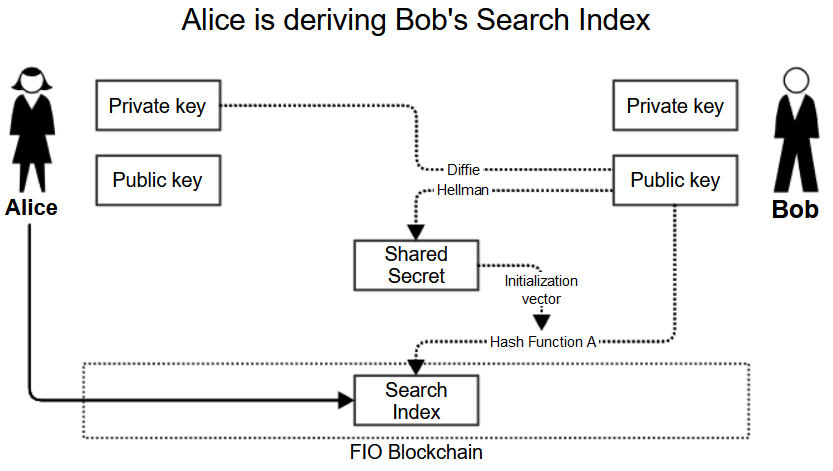
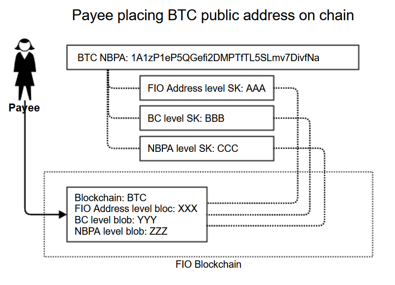
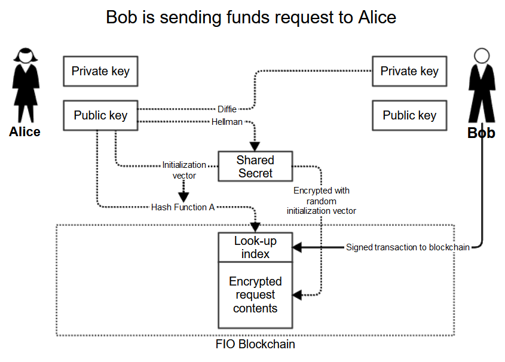
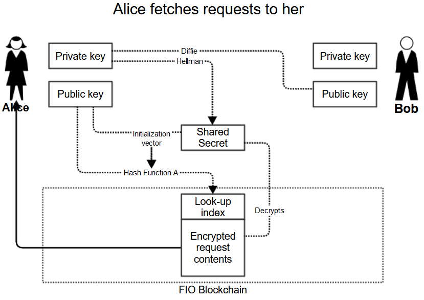
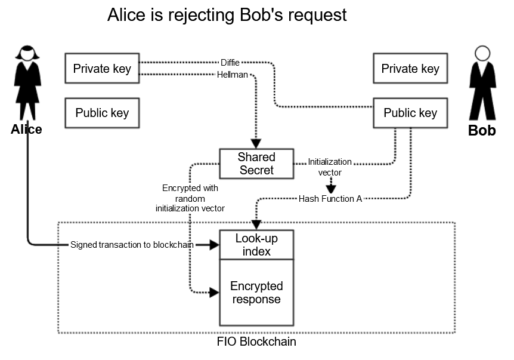

## Terminology
* **Native Blockchain Public Address (NBPA)** - this is the public address on a native blockchain that is needed to send funds and is associated to the FIO Address using [/add_pub_address](https://developers.fioprotocol.io/api/api-spec/reference/add-pub-address/add-pub-address-model)
* **Payee** - is the user receiving funds. In the Send scenario, this is the user who places NBPA on the FIO Chain and allows Payer to see it so that the Payer can send funds using this NBPA. In Request scenario, this is the user sending a FIO Request.
* **Payer** - is the user sending funds using FIO Address. In the Send scenario, Payer will type a FIO Address in wallet, that wallet will look up the corresponding NBPA on native blockchain and transaction will be executed. In Request scenario, Payer will repond to a FIO Request sent by Payee.
* **Sender** - is the user sending a transaction on the FIO Chain to another user (Receiver)
* **Receiver** - is the user receiving a transaction on the FIO Chain from another user (Sender)

## Abstract
This FIP implements several new features to enhance privacy of the FIO Protocol:
* It extends the existing FIO Data encryption scheme to include NBPAs to optionally encrypt NBPAs placed on chain.
* It introduces a new way to exchange FIO Requests, FIO Data, and NBPAs, which obfuscates the fact that the users are interacting with each other.
* It consolidates [record_obt_data](https://developers.fioprotocol.io/api/api-spec/reference/record-obt-data/record-obt-data-model) and [reject_funds_request](https://developers.fioprotocol.io/api/api-spec/reference/reject-funds-request/reject-funds-request-model) into a single priv_record_send_action as to further obfuscate the action which was taken on a FIO Request.

The introduced actions will coexist with existing actions to ensure backwards compatibility.

Proposed new actions:

|Action|Endpoint|Description|
|---|---|---|
|privaddadr|priv_add_pub_address|Add encrypted NBPA to FIO Chain.|
|privganbpa|priv_grant_pub_address_access|Grants user access to see NBPA.|
||priv_get_pub_address|Allows user to retrieve NBPA they are authorized to see.|
|privfundsreq|priv_new_funds_request|Allows for creation of FIO Requests using new, privacy-enhancing, mode.|
|privrecsend|priv_record_send_action|Allows for recording of OBT Data or rejecting a FIO Request using new, privacy-enhancing, mode.|
||priv_get_received_fio_requests|Returns FIO Request received using new, privacy-enhancing, mode.|
||priv_get_sent_fio_requests|Returns FIO Requests sent using new, privacy-enhancing, mode.|
||priv_get_received_actions|Returns OBT Data or FIO Request rejections using new, privacy-enhancing, mode.|
|setaddpriv|set_fio_address_privacy|Sets privacy mode for FIO Address.|
||privacy_check|Checks privacy mode of FIO Address.|

## Motivation
Even though contents of FIO Requests and OBT Records is already encrypted, there are two other areas where privacy of the FIO Protocol can be improved:
* Anytime a FIO Request or OBT Record is stored on chain, the FIO Addresses of both parties are stored unencrypted. This allows blockchain observers to:
  * Associate FIO Addresses transacting with each other, even though the details of those transactions are private.
* NBPAs mapped to FIO Addresses are stored on-chain unencrypted. This allows blockchain observers to:
  * Associate NBPAs to identifiable FIO Addresses.
  * Associate NBPAs on different blockchains belonging to a single individual/entity through a common FIO Address.

## Specification
### Search Index
Today when data is exchanged on the FIO Chain (FIO Requests, FIO Data) FIO Addresses and FIO Public Keys of both parties are attached to each record. This is done because:
* **Sender** - account data (e.g. FIO Public Address) of the signer has to be visible for the blockchain to validate the transaction.
* **Receiver** - there needs to be a way for the receiver to know that there is data on the blockchain for them to receive. Today the Receiver uses their FIO Public Key to query for data, therefore the Sender has to include this in the transaction they expect the Receiver to find.

In order to obfuscate that Sender and Receiver are interacting, one party's information has to be encrypted. Obfuscating Sender's data is difficult without changing the architecture of the blockchain to a more complex privacy chain architecture. Obfuscating the Receiver's data is easy, but it makes it challenging for the Receiver to identify transactions on the chain that contain information for them.

To solve this challenge, this FIP introduces the concept of a **Search Index**. This index uses [Diffie-Hellman Key Exchange scheme](https://en.wikipedia.org/wiki/Diffie%E2%80%93Hellman_key_exchange) and can be derived by both Sender and Receiver without any on-chain interaction as it only requires their own private key and the other party's public key.

#### How is Search Index derived
* Sender wants to derive Search Index for Receiver and types their FIO Address into their wallet.
* Sender's wallet fetches FIO Public Key associated with the FIO Address entered.
* Sender's wallet uses Sender's FIO Private Key and Receiver's FIO Public Key to derive a shared secret (Secret) using [Diffie-Hellman Key Exchange scheme](https://en.wikipedia.org/wiki/Diffie%E2%80%93Hellman_key_exchange).
* Receiver's FIO Public Key is hashed using [Hash Function A](https://github.com/fioprotocol/fiojs/blob/3b3604bb148043dfb7e7c2982f4146a59d43afbe/src/tests/encryption-fio.test.ts#L65) and Secret as initialization vector to create Receiver's Search Index.



#### How is Search Index used
A user derives a Search Index using counter-party's FIO Public Key, when they are placing data on chain. A user derives a Search Index using their own FIO Public Key, when they are looking for data placed on chain by their counter-party.

|Scenario|How used by Payer|How used by Payee|
|---|---|---|
|Payee makes NBPA available to Payer|Payee places NBPA encrypted on chain with Payer's Search Index.|Payer looks for their Search Index when looking for NBPA.|
|Payee sends FIO Request to Payer|Payee places FIO Request on chain with Payer's Search Index.|Payer looks for their Search Index when looking for FIO Requests.|
|Payer responds to FIO Request|Payer places Send Action on chain with Payee's Search Index.|Payee looks for their Search Index when looking for Send Actions.|

It is important to note that the Search Index is derived from Public Keys and not FIO Addresses, yet for usability reasons user will use FIO Addresses to identify each other. This has the following consequences:
* Once user transfers their FIO Address to another public key (even if they control it), they will lose their established connections. That is already a moot point, since they will not be able to decrypt the data anyway.
* Once established, connections exist between all FIO Addresses owned by either party.

### Search Index actions
The following is a list of new contract actions and endpoint added to support Search Indexes.
#### Backup Search Indexes.
This action stores back-up of FIO Addresses, where associated Search Index should be monitored for incoming FIO Requests and FIO Data. This is an optional action and is intended to allow wallets that rely on seed phrase recovery to be able to fully restore FIO functionality.
##### New action: *bkupsrchidxs*
##### New endpoint: /priv_backup_search_indexes
##### New fee: priv_backup_search_indexes, bundle-eligible (uses 1 bundled transaction) per incremental 1,000 bytes
##### Request
|Parameter|Required|Format|Definition|
|---|---|---|---|
|fio_public_address|Yes|FIO Address|FIO Address for which data is being backed-up.|
|content|Yes|FIO public key|Encrypted blob. See below.|
|max_fee|Yes|Positive Int|Maximum amount of SUFs the user is willing to pay for fee. Should be preceded by [/get_fee](https://developers.fioprotocol.io/api/api-spec/reference/get-fee/get-fee) for correct value.|
|tpid|Yes|FIO Address|FIO Address of the entity which generates this transaction. TPID rewards will be paid to this address. Set to empty if not known.|
|actor|Yes|12 character string|Valid actor of signer|
###### *content* format
The content element is a **packed** and encrypted symmetrically with owner's FIO Private Key:
|Group|Parameter|Required|Format|Definition|
|---|---|---|---|---|
|search_indexes||Yes|Array|Array of Search Indexes|
|search_indexes|search_index|Yes|string|Search Index of counter-party.|
|search_indexes|fio_address|Yes|String|FIO Address of counter-party.|
|search_indexes|public_key|Yes|FIO Public Key|FIO Public Key of counter-party.|
###### Example
```
{
	"fio_public_address": "purse@alice",
	"content": "...",
	"max_fee": 0,
	"tpid": "",
	"actor": "aftyershcu22"
}
```
##### Processing
* Request is validated per Exception handling.
* Fee is collected
  * The fee is collected based on incremental size. For example if user was already storing 10,000 bytes and the new size is 11,000 bytes, they will be charged for 1,000 bytes.
* Content is placed on chain. The content replaces the currently stored value.
##### Exception handling
|Error condition|Trigger|Type|fields:name|fields:value|Error message|
|---|---|---|---|---|---|
|Invalid FIO Address|Format of FIO Address not valid or FIO Address does not exist.|400|"payee_fio_address"|Value sent in, i.e. "purse@alice"|"FIO Address invalid or does not exist."|
|FIO Address expired|Supplied FIO Address has expired|400|"payer_fio_address"|Value sent in, i.e. "purse@alice"|"FIO Address expired."|
|FIO Domain expired|Domain of supplied FIO Address has expired more than 30 days ago|400|"payer_fio_address"|Value sent in, i.e. "purse@alice"|"FIO Domain expired."|
|Invalid fee value|max_fee format is not valid|400|"max_fee"|Value sent in, e.g. "-100"|"Invalid fee value"|
|Insufficient funds to cover fee|Account does not have enough funds to cover fee|400|"max_fee"|Value sent in, e.g. "1000000000"|"Insufficient funds to cover fee"|
|Invalid TPID|tpid format is not valid|400|"tpid"|Value sent in, e.g. "notvalidfioaddress"|"TPID must be empty or valid FIO address"|
|Fee exceeds maximum|Actual fee is greater than supplied max_fee|400|max_fee"|Value sent in, e.g. "1000000000"|"Fee exceeds supplied maximum"|
|Not owner of FIO Address|The signer does not own the FIO Address|403|||Type: invalid_signature|
##### Response
|Parameter|Format|Definition|
|---|---|---|
|status|String|OK if successful|
|fee_collected|Int|Amount of SUFs collected as fee|
###### Example
```
{
	"status": "OK",
	"fee_collected": 2000000000
}
```

#### Get Search Index Back-up.
Returns Search Index Backup.
##### New endpoint: /priv_get_search_index_backup
##### Request
|Parameter|Required|Format|Definition|
|---|---|---|---|
|fio_address|Yes|FIO Address|FIO Address of owner.|
###### Example
```
{
	"fio_address": "purse@alice"
}
```
##### Exception handling
|Error condition|Trigger|Type|fields:name|fields:value|Error message|
|---|---|---|---|---|---|
|No backup|No backup for supplied FIO Address|404|||"No backup found."|
##### Response
|Parameter|Format|Definition|
|---|---|---|
|content|String|See Backup Search Indexes|
###### Example
```
{
    "content": "..."
}
```

### NBPA mappings
In existing implementation, NBPAs are placed on FIO Chain unencrypted. Once this FIP is implemented, users will have an option to place it encrypted for specific users.

In order to offer the most flexibility to users and to reduce the amount of content stored on the FIO Chain, each NBPA is encrypted symmetrically three separate times using different random secret key each time:
* FIO Address level secret key – used to encrypt all NBPAs associated with that FIO Address.
* Chain level secret key – used to encrypt all NBPAs for a particular chain (i.e. Ethereum).
* NBPA level secret key – only used to encrypt one NBPA.

NBPA level secret key can decrypt just one NBPA. Chain level secret key can decrypt current NBPA for specific chain and all future NBPAs for that chain published by the owner. FIO Address level secret key can decrypt all NBPAs associated with that FIO Address. The FIO Address owner can then decide which of these decrypt keys to make available to which user by placing them on the FIO Chain encrypted and tagged with Payer's Search Index.

#### Placing NBPA on chain
Each NBPA will be encrypted using three unique secret keys. Method of deriving secret keys (where + is string concatenation):
```
HMAC(hashName, secret, hash) == result
HMAC('sha256', WalletSecret, 'FIO Address level secret key') == NBPA level secret key
HMAC('sha256', WalletSecret, 'Blockchain level secret key') == Blockchain level secret key
HMAC('sha256', WalletSecret, ''NBPA secret key' + AddressPublicKey) == NBPA level secret key
```
The NBPA will then be placed on the FIO Chain using new action as three distinct encrypted blobs. The data includes:
* Chain code
* NBPA encrypted with FIO Address level secret key - this secret will be used to encrypt all NBPAs placed by that FIO Address
* NBPA encrypted with Chain level secret key - this secret will be used to encrypt all NBPAs of a particular chain, e.g. Ethereum.
* NBPA encrypted with NBPA level secret key - this secret is different for every NBPA



#### Placing secret decrypt key on chain
A secret key is placed on the FIO Chain for specific Payer using new action. The data includes:
* Payer's Search Index
* Chain code (if secret key is chain level)
* Key ID (if secret key is for specific key)
* Token code
* Secret Key encrypted asymmetrically using the Payer’s public key to derive shared secret using [Diffie-Hellman Key Exchange scheme](https://en.wikipedia.org/wiki/Diffie%E2%80%93Hellman_key_exchange).

#### Looking up NBPA
Payer looks for NBPA using:
* Their own Search Index
* FIO Address
* Chain code
* Token code

The blockchain will look for secret key with provided Search Index and chain and token code and return correct level encrypted NBPA and corresponding Encrypted Secret Key if found.

##### Example
* Payee places NBPA as follows:
  * NBPA ID: 1
  * Blockchain code: BTC
  * Token code: BTC
  * NBPA encrypted with FIO Address level secret key (Secret 1): ABC
  * NBPA encrypted with Chain level secret key (Secret 2): DEF
  * NBPA encrypted with NBPA level secret key (Secret 3): GHI
* Payee places secret for Payer 1 to decrypt all BTC addresses:
  * Search Index: index_for_payer_1
  * Blockchain code: BTC
  * Key ID: 1
  * Encrypted Secret Key: XXX
* Payee places secret for Payer 2 to decrypt just one BTC address:
  * Search Index: index_for_payer_2
  * Blockchain code: BTC
  * Key ID: 1
  * Encrypted Secret Key: YYY
* Payer 1 sends index_for_payer_1 and BTC/BTC and receives:
  * XXX - Payer 1 decrypts Secret 2 with their private key
  * DEF - Payer 1 decrypts NBPA with Secret 2
* Payer 2 sends index_for_payer_2 and BTC/BTC and receives:
  * YYY - Payer 2 decrypts Secret 3 with their private key
  * GHI - Payer 2 decrypts NBPA with Secret 3

### NBPA mappings actions
The following is a list of new contract actions and endpoint added to support encrypted NBPAs.
#### Add NBPA.
Adds NBPA to chain.
##### New action: *privaddadr*
##### New endpoint: /priv_add_pub_address
##### New fee: priv_add_pub_address, bundle-eligible (uses 1 bundled transaction)
##### Request
|Parameter|Required|Format|Definition|
|---|---|---|---|
|payee_fio_address|Yes|FIO Address|FIO Address for which NBPA is being added.|
|public_addresses|Yes|JSON Array. See public_addresses below Min: 1 item Max: 5 items|
|max_fee|Yes|Positive Int|Maximum amount of SUFs the user is willing to pay for fee. Should be preceded by [/get_fee](https://developers.fioprotocol.io/api/api-spec/reference/get-fee/get-fee) for correct value.|
|tpid|Yes|FIO Address|FIO Address of the entity which generates this transaction. TPID rewards will be paid to this address. Set to empty if not known.|
|actor|Yes|12 character string|Valid actor of signer|
###### *public_addresses* format
|Parameter|Required|Format|Definition|
|---|---|---|---|
|chain_code|Yes|String|Chain code of NBPA being added, not encrypted.|
|token_code|Yes|String|Token code of NBPA being added, not encrypted.|
|public_key_address_level|Yes|String|NBPA encrypted with FIO Address-level secret.|
|public_key_chain_level|Yes|String|NBPA encrypted with chain-level secret.|
|public_key_nbpa_level|Yes|String|NBPA encrypted with NBPAs-level secret.|
###### Example
```
{
	"payee_fio_address": "purse@alice",
	"public_addresses": [
		{
			"chain_code": "BTC",
			"token_code": "BTC",
			"public_key_address_level": "jK4P6yxXwoZjCz4xodEVMY63PZQEvs1GVRUSusohSpFzO8mBegxGE1Zl7yYqxwqHIWYrxihOxJya51QMVzyJVv8z2S2fnWUB",
			"public_key_chain_level": "5zsyqCjsZ9bAGfQybQKIGZL36UQldukmoJMq410SQzIVeSus1dozqGZu4X8Fh0qzHioAL4dwIkORz7cG8XAtQ1ZOG9vaK9su",
			"public_key_nbpa_level": "uE98xys0iDlmJyPdrTof09iZbqxIJEDXZC6KlyRdtgdgrt2E1XWUr04h9JE7CvtGCHDan2G58x0BzzXi7NnsTyCaSi05ird1"
		},
		{
			"chain_code": "ETH",
			"token_code": "USDC",
			"public_key_address_level": "cXg5EEs5i0wqR5K0eskMo02Q3Tsqpt0VCeU9MPAkvlPC3g5cJd690aeEmBlkHsvOGTEI7KiQZ7W4kWfwaOCTq8rDja3p6kRw",
			"public_key_chain_level": "GUzY0kzw61nFChs9EWVear5oHNRLQRci2qbv4kQQNztg8JY6Q3atEnKYrcdfDWr4HzmXx23hDfZfWbw4LjwyFSlZyOqc6z3G",
			"public_key_nbpa_level": "ddegiZfBqENdtVWGsgzeDsSJHlQGwmlTtUxpzEcI4hkkbVhHbR96ow9tPD1EALLnqigl9hF4scxt9qPfCh1bavPWLN9X1jie"
		}
	],
	"max_fee": 0,
	"tpid": "rewards@wallet",
	"actor": "aftyershcu22"
}
```
##### Processing
* Request is validated per Exception handling.
* Fee is collected
* Content is placed on chain
##### Exception handling
|Error condition|Trigger|Type|fields:name|fields:value|Error message|
|---|---|---|---|---|---|
|Invalid FIO Address|Format of FIO Address not valid or FIO Address does not exist.|400|"payee_fio_address"|Value sent in, i.e. "purse@alice"|"FIO Address invalid or does not exist."|
|FIO Address expired|Supplied FIO Address has expired|400|"payer_fio_address"|Value sent in, i.e. "purse@alice"|"FIO Address expired."|
|FIO Domain expired|Domain of supplied FIO Address has expired more than 30 days ago|400|"payer_fio_address"|Value sent in, i.e. "purse@alice"|"FIO Domain expired."|
|Invalid chain format|Supplied chain code is not a valid format.|400|"chain_code"|Value sent in, i.e. "BTC!@#$%^&\*()"|"Invalid Chain Code"|
|Invalid token format|Supplied token code is not a valid format.|400|"token_code"|Value sent in, i.e. "BTC!@#$%^&\*()"|"Invalid Token Code"|
|Invalid fee value|max_fee format is not valid|400|"max_fee"|Value sent in, e.g. "-100"|"Invalid fee value"|
|Insufficient funds to cover fee|Account does not have enough funds to cover fee|400|"max_fee"|Value sent in, e.g. "1000000000"|"Insufficient funds to cover fee"|
|Invalid TPID|tpid format is not valid|400|"tpid"|Value sent in, e.g. "notvalidfioaddress"|"TPID must be empty or valid FIO address"|
|Fee exceeds maximum|Actual fee is greater than supplied max_fee|400|max_fee"|Value sent in, e.g. "1000000000"|"Fee exceeds supplied maximum"|
|Not owner of FIO Address|The signer does not own the FIO Address|403|||Type: invalid_signature|
##### Response
|Parameter|Format|Definition|
|---|---|---|
|status|String|OK if successful|
|key_id|Int|ID of key|
|fee_collected|Int|Amount of SUFs collected as fee|
###### Example
```
{
	"status": "OK",
	"key_id: 1000000,
	"fee_collected": 2000000000
}
```
#### Grant NBPA access
Grants NBPA access to specific user by placing a decrypt secret for them.
##### New action: *privganbpa*
##### New endpoint: /priv_grant_pub_address_access
##### New fee: priv_grant_pub_address_access, bundle-eligible (uses 1 bundled transaction)
##### Request
|Parameter|Required|Format|Definition|
|---|---|---|---|
|payer_search_index|Yes|String|Search Index of user being granted access.|
|decrypt_keys|Yes|JSON Array. See decrypt_keys below Min: 1 item Max: 5 items|
|payee_fio_address|Yes|FIO Address|FIO Address which is associated with NBPA and which will be charged bundled transaction.|
|max_fee|Yes|Positive Int|Maximum amount of SUFs the user is willing to pay for fee. Should be preceded by [/get_fee](https://developers.fioprotocol.io/api/api-spec/reference/get-fee/get-fee) for correct value.|
|tpid|Yes|FIO Address|FIO Address of the entity which generates this transaction. TPID rewards will be paid to this address. Set to empty if not known.|
|actor|Yes|12 character string|Valid actor of signer|
###### *decrypt_keys* format
|Parameter|Required|Format|Definition|
|---|---|---|---|
|level|Yes|String|Level of decryption key: address, chain, nbpa|
|level_index|Yes|String|Level index: for address-level: FIO Address, for chain-level: chain code, for nbpa: key ID|
|decrypt_key|Yes|String|Encrypted key|
###### Example
```
{
	"payer_search_index": "515184318471884685485465454464846864686484464694181384",
	"decrypt_keys": [
		{
			"level": "chain",
			"level_index": "BTC",
			"decrypt_key": "5zsyqCjsZ9bAGfQybQKIGZL36UQldukmoJMq410SQzIVeSus1dozqGZu4X8Fh0qzHioAL4dwIkORz7cG8XAtQ1ZOG9vaK9su"
		},
		{
			"level": "nbpa",
			"level_index": "1000",
			"decrypt_key": "GUzY0kzw61nFChs9EWVear5oHNRLQRci2qbv4kQQNztg8JY6Q3atEnKYrcdfDWr4HzmXx23hDfZfWbw4LjwyFSlZyOqc6z3G"
		}
	],
	"payee_fio_address": "purse@alice",
	"max_fee": 0,
	"tpid": "rewards@wallet",
	"actor": "aftyershcu22"
}
```
##### Processing
* Request is validated per Exception handling.
* Fee is collected
* Content is placed on chain
##### Exception handling
|Error condition|Trigger|Type|fields:name|fields:value|Error message|
|---|---|---|---|---|---|
|Invalid FIO Address|Format of FIO Address not valid or FIO Address does not exist.|400|"payee_fio_address"|Value sent in, i.e. "purse@alice"|"FIO Address invalid or does not exist."|
|FIO Address expired|Supplied FIO Address has expired|400|"payer_fio_address"|Value sent in, i.e. "purse@alice"|"FIO Address expired."|
|FIO Domain expired|Domain of supplied FIO Address has expired more than 30 days ago|400|"payer_fio_address"|Value sent in, i.e. "purse@alice"|"FIO Domain expired."|
|Invalid level format|Supplied level not a valid format.|400|"level"|Value sent in, i.e. "something|"Invalid level."|
|Invalid chain format|Supplied chain code is not a valid format.|400|"level_index"|Value sent in, i.e. "BTC!@#$%^&\*()"|"Invalid Chain Code"|
|Invalid nbpa id format|Supplied nbpa id is not valid or key does not belong to signer.|400|"level_index"|Value sent in, i.e. "BTC!@#$%^&\*()"|"Invalid Chain Code"|
|Invalid fee value|max_fee format is not valid|400|"max_fee"|Value sent in, e.g. "-100"|"Invalid fee value"|
|Insufficient funds to cover fee|Account does not have enough funds to cover fee|400|"max_fee"|Value sent in, e.g. "1000000000"|"Insufficient funds to cover fee"|
|Invalid TPID|tpid format is not valid|400|"tpid"|Value sent in, e.g. "notvalidfioaddress"|"TPID must be empty or valid FIO address"|
|Fee exceeds maximum|Actual fee is greater than supplied max_fee|400|max_fee"|Value sent in, e.g. "1000000000"|"Fee exceeds supplied maximum"|
|Not owner of FIO Address|The signer does not own the FIO Address|403|||Type: invalid_signature|
##### Response
|Parameter|Format|Definition|
|---|---|---|
|status|String|OK if successful|
|fee_collected|Int|Amount of SUFs collected as fee|
###### Example
```
{
	"status": "OK",
	"fee_collected": 2000000000
}
```
#### Get NBPA
Looks up NBPA for supplied FIO Address and chain code.
##### New endpoint: /priv_get_pub_address
##### Request
|Parameter|Required|Format|Definition|
|---|---|---|---|
|payer_search_index|Yes|String|Search Index of Payer.|
|fio_address|Yes|String|FIO Address of Payee|
|chain_code|Yes|Chain code for requested NBPA.|
|token_code|Yes|Token code for requested NBPA.|
###### Example
```
{
	"payer_search_index": "515184318471884685485465454464846864686484464694181384",
	"fio_address": "purse@alice",
	"chain_code": "FIO",
	"token_code": "FIO"
}
```
##### Processing
* Request is validated per Exception handling.
* NBPA is looked up using:
  * Provided FIO Address
  * Chain code
  * Token code
* Decrypt key is looked up using payer_search_index and appropriate decrypt key is returned:
  * if nbpa-level decrypt key exists, it is returned
  * if chain-level decrypt key exists, it is returned
  * if address-level decrypt key exists, it is returned
##### Exception handling
|Error condition|Trigger|Type|fields:name|fields:value|Error message|
|---|---|---|---|---|---|
|Public Address not found|There was no matching NBPA and/or matching decrypt key|404|||"Public address not found"|
##### Response
|Parameter|Format|Definition|
|---|---|---|
|public_address|String|Encrypted public key.|
|decrypt_key|String|Encrypted decrypt key.|
###### Example
```
{
	"public_address": "GUzY0kzw61nFChs9EWVear5oHNRLQRci2qbv4kQQNztg8JY6Q3atEnKYrcdfDWr4HzmXx23hDfZfWbw4LjwyFSlZyOqc6z3G",
	"decrypt_key": "ddegiZfBqENdtVWGsgzeDsSJHlQGwmlTtUxpzEcI4hkkbVhHbR96ow9tPD1EALLnqigl9hF4scxt9qPfCh1bavPWLN9X1jie"
}
```

### FIO Request and FIO Data
#### New Private Funds Request
Payee's wallet submits new private funds request with:
* Unencrypted:
  * Payee FIO Public Key. This will allow Payee to locate their own requests and allow the Payer to decrypt the data.
  * Payee's FIO Address. This will be used to deduct bundled transactions.
  * Payer's Search Index. This will be used by Payer to find requests that are for them.
* Encrypted with Secret + random IV
  * Payer FIO Address. This let's Payer know which FIO Address the request is for.
  * Request details (chain, amount, memo)



#### Fetching New Funds Request
Payer's wallet will use Payee's Search Index to look for FIO Requests for them.



#### Rejecting Funds Request
Payer's wallet records new action with:
* Unencrypted:
  * Payer's FIO Public Key. This will allow Payer to locate their own responses and allow the Payee to decrypt the data.
  * Payer's FIO Address. This will be used to deduct bundled transactions.
  * Payee's Search Index. This will be used by Payee to find responses.
* Encrypted with Secret + IV
  * FIO request ID
  * Status = rejected
    


#### Recording OBT Data aka accepting funds request
Payer's wallet records new action with:
* Unencrypted:
  * Payer's FIO Public Key. This will allow Payer to locate their own responses and allow the Payee to decrypt the data..
  * Payer's FIO Address. This will be used to deduct bundled transactions
  * Payee's Search Index. This will be used by Payee to find this record.
* Encrypted with Secret + IV:
  * FIO request ID (if in response to request)
  * Status = sent_to_blockchain
  * Payer FIO Address. This let's Payee know which FIO Address the request is from.
  * Payee FIO Address. This let's Payee know which FIO Address the request is for.
  * Transaction details (chain, amount, memo)
    
#### Fetching sent FIO Requests
Payee fetches their own request using their FIO public key, which is unencrypted on chain.

#### Fetching send actions
This is a new construct which returns all send actions, e.g. request rejections or recorded OBT content. Since the details are now encrypted, it's not possible to get the status together with Funds Requests. Payee's wallet will use their own Search Index to fetch:
* Reject messages
* Record OBT messages

The Payee's wallet is responsible for putting together all requests from get_sent_fio_requests with their associated statuses

### FIO Request and FIO Data actions
The following is a list of new contract actions and endpoint added to support encrypted FIO Request and FIO Data.
#### New funds request
Creates nen Funds Request using privacy method.
##### New action: *privfundsreq*
##### New endpoint: /priv_new_funds_request 
##### New fee: priv_new_funds_request, bundle-eligible (uses 2 bundled transaction)
##### Request
|Parameter|Required|Format|Definition|
|---|---|---|---|
|payee_fio_address|Yes|FIO Address|FIO Address of the payee.|
|payee_fio_public_key|Yes|FIO Public Key|FIO Public Key of the payee.|
|payer_search_index|Yes|String|Payer's Search Index. This will be used by Payer to find requests that are for them.|
|content|Yes|FIO public key|Encrypted blob. Same as content element of [/new_funds_request](https://developers.fioprotocol.io/api/api-spec/reference/new-funds-request/new-funds-request-model)|
|max_fee|Yes|Positive Int|Maximum amount of SUFs the user is willing to pay for fee. Should be preceded by [/get_fee](https://developers.fioprotocol.io/api/api-spec/reference/get-fee/get-fee) for correct value.|
|tpid|Yes|FIO Address|FIO Address of the entity which generates this transaction. TPID rewards will be paid to this address. Set to empty if not known.|
|actor|Yes|12 character string|Valid actor of signer|
###### Example
```
{
	"payee_fio_address": "crypto@bob",
	"payee_fio_public_key": "FIO8PRe4WRZJj5mkem6qVGKyvNFgPsNnjNN6kPhh6EaCpzCVin5Jj",
	"payer_search_index": "515184318471884685485465454464846864686484464694181384",
	"content": "...",
	"max_fee": 0,
	"tpid": "",
	"actor": "aftyershcu22"
}
```
##### Processing
* Request is validated per Exception handling
* Fee is collected
* Content is placed on chain
##### Exception handling
|Error condition|Trigger|Type|fields:name|fields:value|Error message|
|---|---|---|---|---|---|
|Invalid FIO Address|Format of FIO Address not valid or FIO Address does not exist.|400|"payee_fio_address"|Value sent in, i.e. "purse@alice"|"FIO Address invalid or does not exist."|
|FIO Address expired|Supplied FIO Address has expired|400|"payee_fio_address"|Value sent in, i.e. "purse@alice"|"FIO Address expired."|
|FIO Domain expired|Domain of supplied FIO Address has expired more than 30 days ago|400|"payee_fio_address"|Value sent in, i.e. "purse@alice"|"FIO Domain expired."|
|Invalid fee value|max_fee format is not valid|400|"max_fee"|Value sent in, e.g. "-100"|"Invalid fee value"|
|Insufficient funds to cover fee|Account does not have enough funds to cover fee|400|"max_fee"|Value sent in, e.g. "1000000000"|"Insufficient funds to cover fee"|
|Invalid TPID|tpid format is not valid|400|"tpid"|Value sent in, e.g. "notvalidfioaddress"|"TPID must be empty or valid FIO address"|
|Fee exceeds maximum|Actual fee is greater than supplied max_fee|400|max_fee"|Value sent in, e.g. "1000000000"|"Fee exceeds supplied maximum"|
|Not owner of FIO Address|The signer does not own the FIO Address|403|||Type: invalid_signature|
##### Response
|Parameter|Format|Definition|
|---|---|---|
|fio_request_id|Int|ID of FIO Request created.|
|status|String|OK if successful|
|fee_collected|Int|Amount of SUFs collected as fee|
###### Example
```
{
	"fio_request_id": "10",
	"status": "OK",
	"fee_collected": 0
}
```
#### Records send action.
This action is made to record information about a send transaction. Because content is encrypted, two calls used in unencrypted mode ([/record_obt_data](https://developers.fioprotocol.io/api/api-spec/reference/record-obt-data/record-obt-data-model) and [/reject_funds_request](https://developers.fioprotocol.io/api/api-spec/reference/reject-funds-request/reject-funds-request-model)) are combined into a single action.
##### New action: *privrecsend*
##### New endpoint: /priv_record_send_action 
##### New fee: priv_record_send_action, bundle-eligible (uses 2 bundled transaction)
##### Request
|Parameter|Required|Format|Definition|
|---|---|---|---|
|payer_fio_address|Yes|FIO Address|FIO Address of the payer.|
|payer_fio_public_key|Yes|FIO Public Key|FIO Public Key of the payer.|
|payee_search_index|Yes|String|Payee's Search Index. This will be used by Payee to find send actions that are for them.|
|content|Yes|FIO public key|Encrypted blob. Same as content element of [/record_obt_data](https://developers.fioprotocol.io/api/api-spec/reference/record-obt-data/record-obt-data-model)|
|max_fee|Yes|Positive Int|Maximum amount of SUFs the user is willing to pay for fee. Should be preceded by [/get_fee](https://developers.fioprotocol.io/api/api-spec/reference/get-fee/get-fee) for correct value.|
|tpid|Yes|FIO Address|FIO Address of the entity which generates this transaction. TPID rewards will be paid to this address. Set to empty if not known.|
|actor|Yes|12 character string|Valid actor of signer|
###### Example
```
{
	"payer_fio_address": "purse@alice",
	"payer_fio_public_key": "FIO8PRe4WRZJj5mkem6qVGKyvNFgPsNnjNN6kPhh6EaCpzCVin5Jj",
	"payee_search_index": "515184318471884685485465454464846864686484464694181384",
	"content": "...",
	"max_fee": 0,
	"tpid": "",
	"actor": "aftyershcu22"
}
```
##### Processing
* Request is validated per Exception handling
* Fee is collected
* Content is placed on chain
##### Exception handling
|Error condition|Trigger|Type|fields:name|fields:value|Error message|
|---|---|---|---|---|---|
|Invalid FIO Address|Format of FIO Address not valid or FIO Address does not exist.|400|"payer_fio_address"|Value sent in, i.e. "purse@alice"|"FIO Address invalid or does not exist."|
|FIO Address expired|Supplied FIO Address has expired|400|"payer_fio_address"|Value sent in, i.e. "purse@alice"|"FIO Address expired."|
|FIO Domain expired|Domain of supplied FIO Address has expired more than 30 days ago|400|"payer_fio_address"|Value sent in, i.e. "purse@alice"|"FIO Domain expired."|
|Invalid fee value|max_fee format is not valid|400|"max_fee"|Value sent in, e.g. "-100"|"Invalid fee value"|
|Insufficient funds to cover fee|Account does not have enough funds to cover fee|400|"max_fee"|Value sent in, e.g. "1000000000"|"Insufficient funds to cover fee"|
|Invalid TPID|tpid format is not valid|400|"tpid"|Value sent in, e.g. "notvalidfioaddress"|"TPID must be empty or valid FIO address"|
|Fee exceeds maximum|Actual fee is greater than supplied max_fee|400|max_fee"|Value sent in, e.g. "1000000000"|"Fee exceeds supplied maximum"|
|Not owner of FIO Address|The signer does not own the FIO Address|403|||Type: invalid_signature|
##### Response
|Parameter|Format|Definition|
|---|---|---|
|status|String|OK if successful|
|fee_collected|Int|Amount of SUFs collected as fee|
###### Example
```
{
	"status": "OK",
	"fee_collected": 0
}
```
#### Get received FIO Requests
Requests call polls for any FIO Requests sent to the Payer by a specified Payee. Because status is now encrypted, it's no longer possible to return only pending FIO Requests, like it is in current [/get_pending_fio_requests](https://developers.fioprotocol.io/api/api-spec/reference/get-pending-fio-requests/get-pending-fio-requests). It will now be up to the wallet to decrypt each request and obtain status.
##### New endpoint: /priv_get_received_fio_requests 
##### Request
|Parameter|Required|Format|Definition|
|---|---|---|---|
|payer_search_indexes|Yes|JSON Array|Array of Payer Search Indexes.|
|limit|No|Positive Int|Number of requests to return. If omitted, all requests will be returned. Due to table read timeout, a value of less than 1,000 is recommended.|
|offset|No|Positive Int|First request from list to return. If omitted, 0 is assumed.|
###### Example
```
{
	"payer_search_indexes": [
		"515184318471884685485465454464846864686484464694181384",
		"515184318471884685485465454464846864686484464694181385",
		"515184318471884685485465454464846864686484464694181386",
		"515184318471884685485465454464846864686484464694181387"
	],
	"limit": 100,
	"offset": 0
}
```
##### Processing
* Request is validated per Exception handling
* Return *limit* FIO Requests starting at *offset* where payee in *payer_search_indexes*.
##### Exception handling
|Error condition|Trigger|Type|fields:name|fields:value|Error message|
|---|---|---|---|---|---|
|No FIO Requests|No requests were found|404|||"No FIO Requests."|
##### Response
|Group|Parameter|Format|Definition|
|---|---|---|---|
|requests|payee_fio_address|String|FIO Address of the payee.|
|requests|payee_fio_public_key|String|FIO Public Key of the payee.|
|requests|payer_search_index|String|See priv_new_funds_request|
|requests|content|String|Encrypted blob. See priv_new_funds_request|
||more|Int|Number of results remaining|
###### Example
```
{
	"requests": [
		{
			"payee_fio_address": "crypto@bob",
			"payee_fio_public_key": "FIO8PRe4WRZJj5mkem6qVGKyvNFgPsNnjNN6kPhh6EaCpzCVin5Jj",
			"payer_search_index": "515184318471884685485465454464846864686484464694181384",
			"content": "..."
		}
	],
	"more": 0
}
```
#### Get sent FIO Requests
Sent requests call polls for any requests sent by provided FIO Public Key.
##### New endpoint: /priv_get_sent_fio_requests 
##### Request
|Parameter|Required|Format|Definition|
|---|---|---|---|
|fio_public_key|Yes|String|FIO public key of Payee.|
|limit|No|Positive Int|Number of requests to return. If omitted, all requests will be returned. Due to table read timeout, a value of less than 1,000 is recommended.|
|offset|No|Positive Int|First request from list to return. If omitted, 0 is assumed.|
###### Example
```
{
	"fio_public_key": "FIO8PRe4WRZJj5mkem6qVGKyvNFgPsNnjNN6kPhh6EaCpzCVin5Jj",
	"limit": 100,
	"offset": 0
}
```
##### Processing
* Request is validated per Exception handling
* Return *limit* FIO Requests starting at *offset* where payee's FIO Public Key is *fio_public_key*.
##### Exception handling
|Error condition|Trigger|Type|fields:name|fields:value|Error message|
|---|---|---|---|---|---|
|No FIO Requests|No requests were found|404|||"No FIO Requests."|
##### Response
|Group|Parameter|Format|Definition|
|---|---|---|---|
|requests|payee_fio_address|String|FIO Address of the payee.|
|requests|payee_fio_public_key|String|FIO Public Key of the payee.|
|requests|payer_search_index|String|See priv_new_funds_request|
|requests|content|String|Encrypted blob. See priv_new_funds_request|
||more|Int|Number of results remaining|
###### Example
```
{
	"requests": [
		{
			"payee_fio_address": "crypto@bob",
			"payee_fio_public_key": "FIO8PRe4WRZJj5mkem6qVGKyvNFgPsNnjNN6kPhh6EaCpzCVin5Jj",
			"payer_search_index": "515184318471884685485465454464846864686484464694181384",
			"content": "..."
		}
	],
	"more": 0
}
```
#### Get information about actions received.
Requests call polls for any actions taken by Payer in respect to the Payee, i.e. rejections of FIO Requests or OBT Data. Because status is now encrypted, OBT Data and status is now combined in same call. It will now be up to the wallet to decrypt each action and obtain status.
##### New endpoint: /priv_get_received_actions 
##### Request
|Parameter|Required|Format|Definition|
|---|---|---|---|
|payee_search_indexes|Yes|JSON Array|Array of Payee Search Indexes.|
|limit|No|Positive Int|Number of actions to return. If omitted, all actions will be returned. Due to table read timeout, a value of less than 1,000 is recommended.|
|offset|No|Positive Int|First action from list to return. If omitted, 0 is assumed.|
###### Example
```
{
	"payee_search_indexes": [
		"515184318471884685485465454464846864686484464694181384",
		"515184318471884685485465454464846864686484464694181385",
		"515184318471884685485465454464846864686484464694181386",
		"515184318471884685485465454464846864686484464694181387"
	],
	"limit": 100,
	"offset": 0
}
```
##### Processing
* Request is validated per Exception handling
* Return *limit* actions starting at *offset* where payer in *lookup_indexes_for_payer*.
##### Exception handling
|Error condition|Trigger|Type|fields:name|fields:value|Error message|
|---|---|---|---|---|---|
|No Received Actions|No requests were found|404|||"No Received Actions."|
##### Response
|Group|Parameter|Format|Definition|
|---|---|---|---|
|actions|payer_fio_address|String|FIO Address of the payer.|
|actions|payer_fio_public_key|String|FIO Public Key of the payer.|
|actions|payee_search_indexes|String|See priv_record_send_action|
|actions|content|String|Encrypted blob. See priv_record_send_action|
||more|Int|Number of results remaining|
###### Example
```
{
	"actions": [
		{
			"payer_fio_address": "crypto@bob",
			"payer_fio_public_key": "FIO8PRe4WRZJj5mkem6qVGKyvNFgPsNnjNN6kPhh6EaCpzCVin5Jj",
			"payee_search_index": "515184318471884685485465454464846864686484464694181384",
			"content": "..."
		}
	],
	"more": 0
}
```

### FIO Address privacy
#### Set FIO Address privacy options
Allows the FIO Address owner to disallow FIO Request or FIO Data to be sent to their address in a public way. They may still publish NBPAs publicly or initiate public FIO Requests or FIO Data.
##### New action: *setaddpriv*
##### New endpoint: /set_fio_address_privacy
##### New fee: set_fio_address_privacy, bundle-eligible (uses 1 bundled transaction)
##### Request
|Parameter|Required|Format|Definition|
|---|---|---|---|
|fio_address|Yes|String|FIO Address to set private/public.|
|privacy|Yes|Int|0 - Public FIO Requests or FIO Data to this address is allowed; 1 - Public FIO Requests or FIO Data to this address is not allowed.|
|max_fee|Yes|Positive Int|Maximum amount of SUFs the user is willing to pay for fee. Should be preceded by [/get_fee](https://developers.fioprotocol.io/api/api-spec/reference/get-fee/get-fee) for correct value.|
|tpid|Yes|FIO Address|FIO Address of the entity which generates this transaction. TPID rewards will be paid to this address. Set to empty if not known.|
|actor|Yes|12 character string|Valid actor of signer|
###### Example
```
{
	"fio_address": "purse@alice",
	"privacy": 1,
	"max_fee": 2000000000,
	"tpid": "rewards@wallet",
	"actor": "aftyershcu22"
}
```
##### Processing
* Request is validated per Exception handling.
* Fee is collected
* privacy option is set
##### Exception handling
|Error condition|Trigger|Type|fields:name|fields:value|Error message|
|---|---|---|---|---|---|
|Invalid FIO Address|Format of FIO Address not valid or FIO Address does not exist.|400|"payer_fio_address"|Value sent in, i.e. "purse@alice"|"FIO Address invalid or does not exist."|
|FIO Address expired|Supplied FIO Address has expired|400|"payer_fio_address"|Value sent in, i.e. "purse@alice"|"FIO Address expired."|
|FIO Domain expired|Domain of supplied FIO Address has expired more than 30 days ago|400|"payer_fio_address"|Value sent in, i.e. "purse@alice"|"FIO Domain expired."|
|Invalid fee value|max_fee format is not valid|400|"max_fee"|Value sent in, e.g. "-100"|"Invalid fee value"|
|Insufficient funds to cover fee|Account does not have enough funds to cover fee|400|"max_fee"|Value sent in, e.g. "1000000000"|"Insufficient funds to cover fee"|
|Invalid TPID|tpid format is not valid|400|"tpid"|Value sent in, e.g. "notvalidfioaddress"|"TPID must be empty or valid FIO address"|
|Fee exceeds maximum|Actual fee is greater than supplied max_fee|400|max_fee"|Value sent in, e.g. "1000000000"|"Fee exceeds supplied maximum"|
|Not owner of FIO Address|The signer does not own the FIO Address|403|||Type: invalid_signature|
##### Response
|Parameter|Format|Definition|
|---|---|---|
|status|String|OK if successful|
|fee_collected|Int|Amount of SUFs collected as fee|
###### Example
```
{
	"status": "OK",
	"fee_collected": 2000000000
}
```
#### Check FIO Address privacy
Checks FIO Address privacy options.
##### New endpoint: /privacy_check
##### Request
|Parameter|Required|Format|Definition|
|---|---|---|---|
|fio_address|Yes|String|FIO Address to check.|
###### Example
```
{
	"fio_address": "purse@alice"
}
```
##### Processing
* Request is validated per Exception handling.
* Privacy option is returned
##### Exception handling
|Error condition|Trigger|Type|fields:name|fields:value|Error message|
|---|---|---|---|---|---|
|FIO Address not found|Supplied FIO Address cannot be found|404||||
##### Response
|Parameter|Format|Definition|
|---|---|---|
|privacy|Int|Privacy option is returned.|
###### Example
```
{
	"privacy": 1
}
```

### Modification to existing queries
#### get_fio_names, get_fio_addresses
Should now return privacy for all FIO Addresses
```
{
	"fio_addresses": [
		{
			"fio_address": "purse@alice",
			"expiration": "2020-09-11T18:30:56",
			"privacy": 1
		}
	]
}
```
#### new_funds_request
##### new_funds_request to *private* FIO Address
An attempt to send new_funds_request to FIO Address (payer) with privacy set to 1 should result in:
|Error condition|Trigger|Type|fields:name|fields:value|Error message|
|---|---|---|---|---|---|
|FIO Address private|Public FIO Requests not allowed|400|"payer_fio_address"|Value sent in, i.e. "purse@alice"|"Public FIO Requests not allowed."|

#### record_obt_data
An attemp to send record_obt_data to to FIO Address (payer) with privacy set to 1 should result in:
|Error condition|Trigger|Type|fields:name|fields:value|Error message|
|---|---|---|---|---|---|
|FIO Address private|Public OBT records not allowed|400|"payer_fio_address"|Value sent in, i.e. "purse@alice"|"Public OBT records not allowed."|

### Wallet integration effort
The following section describes the steps a wallet would have to take to implement functionality described in this FIP.

## Rationale
### Complexity tradeoffs
Privacy on a public blockchain is a complex problem. The Dapix team has spent several weeks in 2019 brainstorming solutions with number of experts. Without a doubt, the solution contemplated in this FIP is adding significant complexity to the blockchain and for the integrators, even though it is planned that a lot of the complexity will be eliminated in the SDKs.

Complexity could be reduced if certain privacy requirements are relaxed. Specifically:
1. Accept the fact that it will always be public that two FIO Addresses are interacting with each other and that it is sufficient to simply encrypt the content of the interaction. This would: 1) Eliminate the need for fio_public_key_hash, as one could simply use the FIO Address; 2) Allow retention of existing FIO Request workflow; 3) Allow Request for friending to be put on chain. In current form, user has to initiate adding someone to Friend List from within their wallet, i.e. by typing in a FIO Address. [FIP-8](fip-8.md) descibes an approach, which follows this path, albeit slightly modified, and recommends Request for Public Address.
1. If #1 is accepted, FIO Request status can additionally be made public, which would push request filtering, such as "show only pending requests" to the blockchain API, instead of having it done inside wallet/SDK.
1. Eliminate the flexibility of allowing users multi-level encryption of NBPAs. Only address-level encryption would be supported, which would basically mean that once someone is your friend, they will get access to all keys you have shared for any FIO Address you grant them access to.

### Other approaches considered
* FIO Private Messaging - akin to [Onion Routing](https://en.wikipedia.org/wiki/Onion_routing) a new message protocol would be created and BPs would act as message relays. This would be a way to exchange a Request for Friend without any blockchain record. Why discounted:
  * Makes looking up requests harder
  * Require new calls to be built, e.g. *Fetch BPs*
  * Requires messaging functionality to be built
  * Creates complexity of disconnected calls
    * What if BP suddenly goes offline
    * What if original transaction gets forked out, but notification doesn't or vv.
    * Will need retries and error messages, etc.
* Make calls using non-linked keys - in current implementation the new_funds_request call and record_send calls have to be made by the corresponding payee or payer specified in the call. This means that the data is disclosed and the owner signature makes it easy to trace the signer's FIO Address. With this approach privacy-minded users can choose to use different private keys to sign these calls instead of keys which can trace back to their FIO Address. Why discounted:
  * Does not offer privacy by design
  * Makes looking up requests harder
  * Using a separate key may be cumbersome for some
  * May require wallet implementation
* Randomize FIO Addresses - in this approach, a record is placed by the known party on the blockchain (request placed by payee, reject by payer, record send by payer), but the counter party is disclosed together with X number of other randomly selected FIO Addresses. Why discounted:
  * Depending on the activity of the other members in the random group, the recipient may still have to inspect a large number of requests. For example, what is Alice is paired in a group with Amazon, which has million requests.

### Why do we encrypt a NBPA with three secret keys?
Assuming we want to offer the flexibility to users to decide which user can see which NBPA, this was meant to be an alternative to encrypting NBPA for each user separately. For example, if a user has placed 20 NBPAs on the FIO Chain for Payer 1 and they now wanted to give the same access to Payer 2, they would need to place 20 new entries on the FIO Chain. With secret keys, they will place the 20 NBPAs once and then just give one secret key to Payer 1 and 1 secret key to Payer 2, reducing the amount of data that needs to be stored on chain.

We've considered using a SLIP-44 derivation path for those keys, but it does not seem like a good approach, because there would still need to be some index that matched the keys to records on the FIO blockchain.

## Implementation
Will be provided in a later stage of the FIP.

## Backwards compatibility
Users can simultaneously use new private actions as well as public actions except that if FIO Address owner has set their FIO Address to privacy to 1, FIO Requests and FIO Data to that Address will not be allowed.

get_fio_names and get_fio_addresses are modified, but only in response, where a new field is added.

new_funds_request and record_obt_data are modified, but only new type of error is being added.

## Future considerations
None
