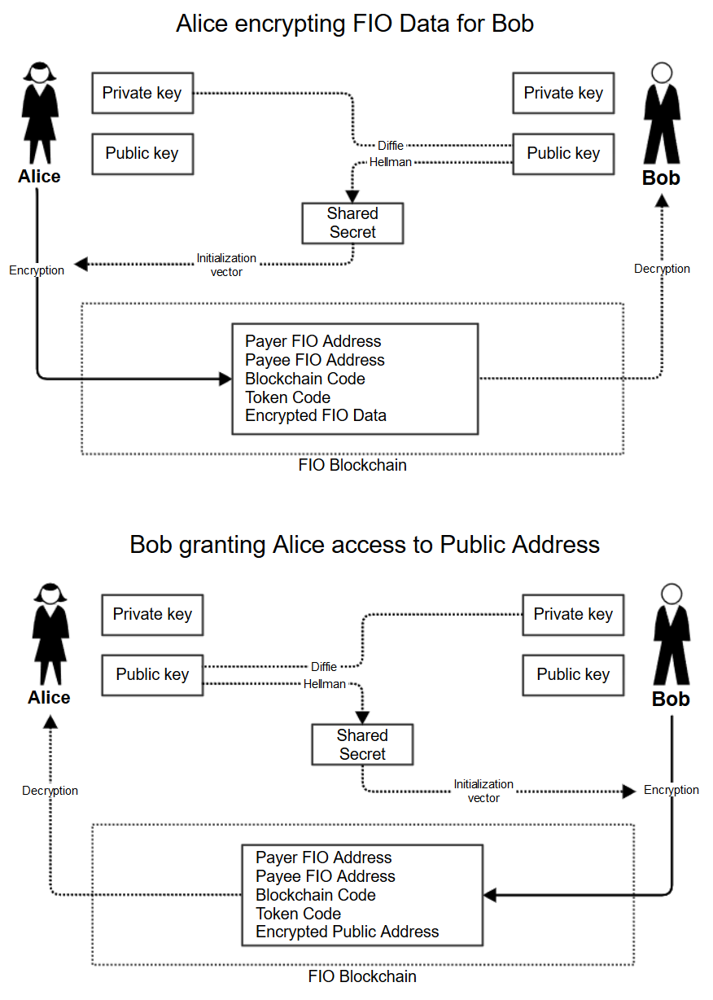

## Abstract

## Terminology
* **Public Address** - this is the Public Address on a native blockchain that is needed to send funds and is associated to the FIO Address using [/add_pub_address](https://developers.fioprotocol.io/api/api-spec/reference/add-pub-address/add-pub-address-model)
* **Payee** - is the user receiving funds. In the Send scenario, this is the user who places Public Address on the FIO Chain and allows Payer to access it.
* **Payer** - is the user sending funds using FIO Address. In the Send scenario, Payer will type a FIO Address in wallet, that wallet will look up the corresponding Public Address on native blockchain and transaction will be executed.

## Motivation
[FIP-5 Enhanced privacy via friending](fip-5.md) proposes to improve FIO Protocol privacy in two areas:
1. Public Addresses mapped to FIO Addresses are stored on-chain unencrypted.
1. Anytime a FIO Request or OBT Record is stored on chain, the FIO Addresses of both parties are stored unencrypted.

The solution proposed in FIP-5 is [arguably complex](fip-5.md#complexity-tradeoffs), both in terms of blockchain code, but, more importantly, in terms of wallet integration. This FIP proposes that issue #1 is the primary privacy concern that should be addressed and that issue #2 should not be addressed at this time to substantially reduce complexity.

Issue #1 could be solved by allowing Payer to first request a Public Address from Payee via an on-chain Request for Public Address with optional encrypted metadata, and then allowing the Payee to place the Public Address via an on-chain Grant Public Address, where the Public Address is encrypted for the Payer. There is no need for a Friend's List or complex hashing to derive search indexes.

In addition, Request for Public Address may have other useful applications. It may allow the Payee to withhold the release of the public address, preventing receipt of funds, until certain information is received. For example, a crypto exchange may not allow a deposit to occur until they have received information about the counter party, in order to comply with the [Travel Rule](https://www.fatf-gafi.org/documents/documents/virtual-currency-definitions-aml-cft-risk.html).

## Specification
### Overview
Conceptually Request for Public Address is very similar to [New Funds Request](https://developers.fioprotocol.io/api/api-spec/reference/new-funds-request/new-funds-request-model) except for the contents. Similarly, Granting Access to Public Key is similar to responding to New Funds Request using [Record OBT Data](https://developers.fioprotocol.io/api/api-spec/reference/record-obt-data/record-obt-data-model).



When Bob grants access to the Public Address, he would also specify how long that Public Address is valid, so that, in the future, Alice may send Bob crypto without the need to request the public address again.

Typical sequence of events:
1. Alice wants to send Bob 1 BTC and types his FIO Address: bob@hodl in the send area of her wallet.
1. The wallet checks the blockchain for any mappings for chain_code: BTC, token_code: BTC for bob@hodl using existing [/get_pub_address](https://developers.fioprotocol.io/api/api-spec/reference/get-pub-address/get-pub-address).
1. Since Bob does not make any Public Address public, the blockchain returns a "Public address not found".
1. Alice's wallet automatically recommends she requests a Public Address from Bob. She accepts the suggestion and the wallet submits Request for Public Address for chain_code: BTC, token_code: BTC to bob@hodl.
1. Bob receives the request in the existing FIO Requests section of the wallet and with a tap grants access to the BTC address to Alice for a period of 1 month.
1. Alice can see all her existing Public Address requests in her wallet together with the status and public address (until expiration). The wallet may also monitor specific requests and show a notification once Public Address access is granted.
1. Alice selects the FIO Address of Payee and executes a transaction.
1. Until the Public Address expires, she can simply type in bob@hodl in send area of BTC and the existing [/get_pub_address](https://developers.fioprotocol.io/api/api-spec/reference/get-pub-address/get-pub-address) will return the Public Address which is encrypted for her alleviating the need for another Request for Public Address.

### New actions
#### Request for Public Address
Requests Public Address for specific chain/token from a FIO Address.
##### New action: *newpubaddreq*
##### New endpoint: /new_pub_address_request
##### New fee: new_pub_address_request, bundle-eligible (uses 2 bundled transactions)
##### Request
|Parameter|Required|Format|Definition|
|---|---|---|---|
|payee_fio_address|Yes|String, valid FIO Address|FIO Address of the payee. This address will receive the request and will provide the Public Address.|
|payer_fio_address|Yes|String, valid FIO Address|FIO Address of the payer. This address is sending the request and will initiate payment once Public Address is received.|
|chain_code|Yes|String|Chain code of Public Address being requested, not encrypted.|
|token_code|Yes|String|Token code of Public Address being requested, not encrypted.|
|content|Yes|String, Min 64 characters, Max 296 characters|Encrypted blob. See below.|
|max_fee|Yes|Positive Int|Maximum amount of SUFs the user is willing to pay for fee. Should be preceded by [/get_fee](https://developers.fioprotocol.io/api/api-spec/reference/get-fee/get-fee) for correct value.|
|tpid|Yes|FIO Address|FIO Address of the entity which generates this transaction. TPID rewards will be paid to this address. Set to empty if not known.|
|actor|Yes|12 character string|Valid actor of signer|
###### *content* format
The content element is a packed and encrypted version of the following data structure. See [Encrypting FIO Data](https://developers.fioprotocol.io/wallet-integration-guide/encrypting-fio-data) for more information.
|Parameter|Required|Format|Definition|
|---|---|---|---|
|memo|No|String|Memo text|
|hash|No|String|Hash of offline data|
|offline_url|No|String|URL pointer to offline data|
|future_use||||
|future_use||||
|future_use||||
|future_use||||
###### Example
```
{
	"payee_fio_address": "purse@alice",
	"payer_fio_address": "crypto@bob",
	"chain_code": "BTC",
	"token_code": "BTC",
	"content": "JhTnxX9ntI9n1eucNuJzHS1/JXeLj+GYmPD1uXG/5PBixQeHg40d4p4yHCm6fxfn7eKzcYFlV2AFrQ7j/kRQJUk5OcvJzZtCYuvIx6snciwhOvYtBlN7MWKavxWV3XGAJHBrQxxcHQGW0rtCZM4KzVYYqXWMzihN6mRGDqxGALc=",
	"max_fee": 0,
	"tpid": "",
	"actor": "aftyershcu22"
}
```
##### Processing
* Request is validated per Exception handling.
* Fee is collected
* Content is placed on chain. In addition to data provided in call, the FIO public key of Payer and Payee, must be stored to ensures they can know which private key to use to decrypt the data. It's possible that a single Payer-Payee pair can have multiple requests for the same chain-token pair.
##### Exception handling
|Error condition|Trigger|Type|fields:name|fields:value|Error message|
|---|---|---|---|---|---|
|Invalid Payee FIO Address|Format of FIO Address not valid or FIO Address does not exist.|400|"payee_fio_address"|Value sent in, i.e. "alice@purse"|"FIO Address invalid or does not exist."|
|Invalid Payer FIO Address|Format of FIO Address not valid or FIO Address does not exist.|400|"payer_fio_address"|Value sent in, i.e. "alice@purse"|"FIO Address invalid or does not exist."|
|Invalid chain format|Supplied chain code is not a valid format.|400|"chain_code"|Value sent in, i.e. "BTC!@#$%^&\*()"|"Invalid Chain Code"|
|Invalid token format|Supplied token code is not a valid format.|400|"token_code"|Value sent in, i.e. "BTC!@#$%^&\*()"|"Invalid Token Code"|
|Content exceeds limits|content field is less than min or more than max|400|"content"|Value sent in, e.g. "XXX"|"Requires min 64 max 296 size"|
|Invalid fee value|max_fee format is not valid|400|"max_fee"|Value sent in, e.g. "-100"|"Invalid fee value"|
|Insufficient funds to cover fee|Account does not have enough funds to cover fee|400|"max_fee"|Value sent in, e.g. "1000000000"|"Insufficient funds to cover fee"|
|Invalid TPID|tpid format is not valid|400|"tpid"|Value sent in, e.g. "notvalidfioaddress"|"TPID must be empty or valid FIO address"|
|Fee exceeds maximum|Actual fee is greater than supplied max_fee|400|max_fee"|Value sent in, e.g. "1000000000"|"Fee exceeds supplied maximum"|
|Not owner of FIO Address|The signer does not own the Payer FIO Address|403||||
##### Response
|Parameter|Format|Definition|
|---|---|---|
|pub_add_request_id|Int|ID for this Public Address Request|
|status|String|OK if successful|
|fee_collected|Int|Amount of SUFs collected as fee|
###### Example
```
{
	"pub_add_request_id": 100,
	"status": "OK",
	"fee_collected": 2000000000
}
```
#### Grant Public Address access
Places encrypted Public Address for specific Chain/Token and FIO Address
##### New action: *grantpubadd*
##### New endpoint: /grant_pub_address_access
##### New fee: grant_pub_address_access, bundle-eligible (uses 1 bundled transaction) per 90 days of time till expiration.
The fee and bundled transaction is computed based on the amount of time in the expires field. The fee (or bundled transaction) is incremented every 90 days of time in expires. Example:
* expires = 1 day -> 1 fee amount (or 1 bundled transaction)
* expires = 90 days -> 1 fee amount (or 1 bundled transaction)
* expires = 91 days -> 2 fee amount (or 2 bundled transaction)
* expires = 180 days -> 2 fee amount (or 2 bundled transaction)
The reason for this is that the cost goes up in relation to the expiration time, as that is the minimum amount of time the data has to be kept in state.

##### Request
|Parameter|Required|Format|Definition|
|---|---|---|---|
|payer_fio_address|Yes|String, valid FIO Address|FIO Address of the payer. This address receive the Public Address and initiate the payment.|
|payee_fio_address|Yes|String, valid FIO Address|FIO Address of the payee. This address owns the Public Address and is receiving payment.|
|chain_code|Yes|String|Chain code of Public Address being requested, not encrypted.|
|token_code|Yes|String|Token code of Public Address being requested, not encrypted.|
|pub_address|Yes|String, Min 16 characters, Max 192 characters|Encrypted public address. See [Encrypting FIO Data](https://developers.fioprotocol.io/wallet-integration-guide/encrypting-fio-data) for more information.|
|expires|Yes|Int|Epoch time of when Public Address expires.|
|pub_add_request_id|Yes|Int|ID of Public Address Request which initiated this grant. Maybe left blank if grant not result of request.|
|max_fee|Yes|Positive Int|Maximum amount of SUFs the user is willing to pay for fee. Should be preceded by [/get_fee](https://developers.fioprotocol.io/api/api-spec/reference/get-fee/get-fee) for correct value.|
|tpid|Yes|FIO Address|FIO Address of the entity which generates this transaction. TPID rewards will be paid to this address. Set to empty if not known.|
|actor|Yes|12 character string|Valid actor of signer|
###### Example
```
{
	"payer_fio_address": "crypto@bob",
	"payee_fio_address": "purse@alice",
	"chain_code": "BTC",
	"token_code": "BTC",
	"pub_address": "JhTnxX9ntI9n1eucNuJzHS1/JXeLj+GYmPD1uXG/5PBixQeHg40d4p4yHCm6fxfn7eKzcYFlV2AFrQ7j/kRQJUk5OcvJzZtCYuvIx",
	"expires": 1606516769,
	"pub_add_request_id": 100,
	"max_fee": 0,
	"tpid": "rewards@wallet",
	"actor": "aftyershcu22"
}
```
##### Processing
* Request is validated per Exception handling.
* Fee is collected
* Content is placed on chain. In addition to data provided in call, the FIO public key of Payer and Payee, must be stored to ensures they can know which private key to use to decrypt the data. It's possible that a single Payer-Payee pair can have multiple public addresses for the same chain-token pair.
* If *pub_add_request_id* supplied, its status is changed to: *granted*
##### Exception handling
|Error condition|Trigger|Type|fields:name|fields:value|Error message|
|---|---|---|---|---|---|
|Invalid Payer FIO Address|Format of FIO Address not valid or FIO Address does not exist.|400|"payer_fio_address"|Value sent in, i.e. "alice@purse"|"FIO Address invalid or does not exist."|
|Invalid Payee FIO Address|Format of FIO Address not valid or FIO Address does not exist.|400|"payee_fio_address"|Value sent in, i.e. "alice@purse"|"FIO Address invalid or does not exist."|
|Invalid chain format|Supplied chain code is not a valid format.|400|"chain_code"|Value sent in, i.e. "BTC!@#$%^&\*()"|"Invalid Chain Code"|
|Invalid token format|Supplied token code is not a valid format.|400|"token_code"|Value sent in, i.e. "BTC!@#$%^&\*()"|"Invalid Token Code"|
|Pub Address exceeds limits|pub_address field is less than min or more than max|400|"content"|Value sent in, e.g. "XXX"|"Requires min 16 max 192 size"|
|Invalid expiration|Supplied expiration date is not valid or not in future.|400|"expires"|Value sent in, i.e. 1|"Invalid expires date"|
|Invalid pub_add_request_id|Supplied pub_add_request_id not valid or does not exist.|400|"pub_add_request_id"|Value sent in, i.e. 1|"Invalid Request ID"|
|Invalid fee value|max_fee format is not valid|400|"max_fee"|Value sent in, e.g. "-100"|"Invalid fee value"|
|Insufficient funds to cover fee|Account does not have enough funds to cover fee|400|"max_fee"|Value sent in, e.g. "1000000000"|"Insufficient funds to cover fee"|
|Invalid TPID|tpid format is not valid|400|"tpid"|Value sent in, e.g. "notvalidfioaddress"|"TPID must be empty or valid FIO address"|
|Fee exceeds maximum|Actual fee is greater than supplied max_fee|400|max_fee"|Value sent in, e.g. "1000000000"|"Fee exceeds supplied maximum"|
|Not owner of FIO Address|The signer does not own the Payee FIO Address|403||||
|Not payee in associated request|The payee FIO ADdress in pub_add_request_id request is not owned by signer|403||||
##### Response
|Parameter|Format|Definition|
|---|---|---|
|status|String|OK if successful|
|fee_collected|Int|Amount of SUFs collected as fee|
###### Example
```
{
	"status": "OK",
	"fee_collected": 2000000000
}
```

* reject_pub_add_request
* cancel_pub_add_request

### Modifications to existing API calls
#### [/get_pub_address](https://developers.fioprotocol.io/api/api-spec/reference/get-pub-address/get-pub-address)
get_pub_address API call will be modified to optionally return public addresses encrypted for Payer.
##### Request
|Parameter|Required|Format|Definition|
|---|---|---|---|
|fio_address|Yes|String|Existing Field|
|chain_code|Yes|String|Existing Field|
|token_code|Yes|String|Existing Field|
|payer_fio_address|No|String|**NEW OPTIONAL FIELD:** FIO Address of Payer. If supplied, a specific public address encrypted for Payer will be returned if available.|
|pub_add_request_id|No|Int|**NEW OPTIONAL FIELD:** ID of Public Address Request. If supplied, a specific public addresses encrypted for Payer and matching provided Public Address Request will be returned if available.
```
{
	"fio_address": "purse@alice",
	"chain_code": "BTC",
	"token_code": "BTC",
	"payer_fio_address": "crypto@bob",
	"pub_add_request_id": 100
}
```
##### Processing
* Request is validated per Exception handling.
* Content is returned as in existing call supplemented with:
	* If *payer_fio_address* and *pub_add_request_id* specified, return encrypted public address granted to Payer FIO Address with supplied ID of Public Address Request, provided expiration date has not passed.
	* If *payer_fio_address* specified, return encrypted public address granted to Payer FIO Address irrespective of ID of Public Address Request, provided expiration date has not passed. If multiple exist, return the one added last.
##### Exception handling
In addition to existing.
|Error condition|Trigger|Type|fields:name|fields:value|Error message|
|---|---|---|---|---|---|
|Invalid Payer FIO Address|Format of FIO Address not valid or FIO Address does not exist.|400|"payer_fio_address"|Value sent in, i.e. "alice@purse"|"FIO Address invalid or does not exist."|
|Invalid or non-existant Public Address Request ID|Format of  Public Address Request ID not valid or Public Address Request ID and FIO Address combination does not exist.|400|"pub_add_request_id"|Value sent in, i.e. "100"|"Invalid Public Address Request ID."|
|Address not found|Neither public nor encrypted address found.|404|||"Public address not found"|
##### Response
|Parameter|Format|Definition|
|---|---|---|
|public_address|String|Existing Field|
|encrypted_public_address|String|**NEW OPTIONAL FIELD:** Encrypted Public Address based on request criteria.|
###### Example
```
{
	"public_address": "0xab5801a7d398351b8be11c439e05c5b3259aec9b",
	"encrypted_public_address": "JhTnxX9ntI9n1eucNuJzHS1/JXeLj+GYmPD1uXG/5PBixQeHg40d4p4yHCm6fxfn7eKzcYFlV2AFrQ7j/kRQJUk5OcvJzZtCYuvIx"
}
```

* get_pending_fio_requests
* get_sent_fio_requests
* get_cancelled_fio_requests

## Rationale
Encrypting blockchain code.

One vs multiple encrypted addresses.

## Implementation
* Possible Public Address Request statuses:
	* requested
	* granted
	* rejected

## Backwards Compatibility

## Future considerations
