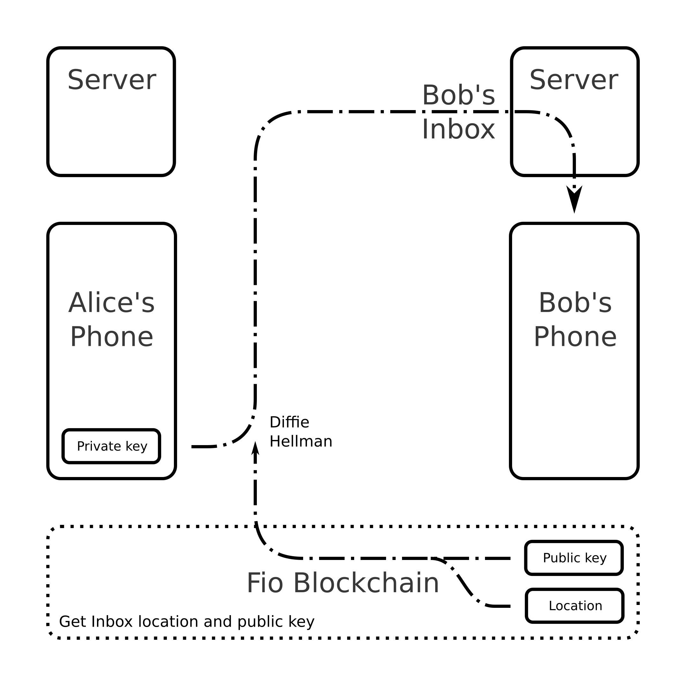

## Abstract
This Fip introduces a standard for private communication between wallets without broadcasting the transaction to the fio blockchain.

## Terminology
* **Sender** - user sending a message.
* **Recipient** - user receiving a message.
* **Message** - information or request the sender submits to the recipient.
* **Wallet** - software following a user's instructions.
* **Location** - address of the inbox used to reach the recipient's wallet. May be an ip address, url, onion address or other form of unique location identifier.
* **Fixed server** - a system that is continuously running and connected to the internet with a fixed domain, ip address or tor address.
* **Public address** - public address in a native blockchain.

## Motivation
Currently, the fio protocol doesn't have a truly private communication system. Standardizing a direct messaging protocol that minimizes the use of the blockchain will increase privacy and reduce per user space consuption on the fio network.

## Specification
A standard will be defined to interchange private encrypted information.

### Methodology
To exchange information with the holder of a fio address, the sender's wallet will fetch an inbox location and the fio public key registered to that fio address using the [/get_pub_address](https://developers.fioprotocol.io/api/api-spec/reference/get-pub-address/get-pub-address) call (or an otherwise defined request call with that purpose). Then it will encrypt a signed message using a shared secret derived with the Diffie Hellman protocol (ECDH with AES-256-CBC) and submit it to the supplied location.

The recipient's wallet will respond using the same method.

### Inbox location
As most wallets aren't regularly available on a managed uninterrupted network, a fixed server (personal, borrowed or rented) might be used as relay for local mobile and desktop wallets, the same way smartphones exchange emails using smtp servers.

### Message construction
All messages will include an encrypted blob and information on how to interpret it.

In order to protect the user's privacy from third parties, all recognizable identification data in the message will be encrypted. The sender is, instead, identified by a token previously assigned by the recipient in a previous message.

#### Body parameters
|Parameter|Required|Format|Definition|
|---|---|---|---|
|protocol|Yes|String|Marks the message as a fio standard direct message.|
|version|Yes|String|Version of the standard used by the sender.|
|id_token|Yes|String - min  8 char max 64 char permitted: [a-Z] [0-9] . - _ +|Token used by the receiver to identify the sender and decode the message with the correct shared secret. This token is assigned by the receiver on a previous message.|
|content|Yes|String|Encrypted exchanged information. See below.|

#### Content
|Parameter|Required|Format|Definition|
|---|---|---|---|
|Data|Yes|String|Information to be sent to recipient.|
|Signature|Yes|String|Sender's authentication signature of "data" field contents.|

##### Data
|Parameter|Required|Format|Definition|
|---|---|---|---|
|action|Yes|String|Description of the information being sent or requested.|
|message_id|Yes|String - min  1 char max 64 char permitted: [a-Z] [0-9] . - _ +|Number used to identify and address the message. Must change for every message.|
|referenced_message_id|When responding or updating a message|String - min  1 char max 64 char permitted: [a-Z] [0-9] . - _ +|message_number of the message being responded or referenced. Used to reference received messages. Same value may be used multiple times.|
|sender_fio_address|Yes|String|Fio address of the sender.|
|recipient_fio_address|Yes|String|Fio address of the recipient.|
|return_address|No|String|Location of inbox to be used to respond the message.|
|return_address_type|No|String|Type of address mentioned in return_address.|
|return_id_token|When establishing communication for the first time|String - min  8 char max 64 char permitted: [a-Z] [0-9] . - _ +|Random string generated by the sender. The recipient will use it to identify himself on future messages. Must be different from id_token and tokens sent to other users.|
|payee_public_address|When requesting funds or releasing public address|String|Blockchain native public address of the payee.|
|chain_code|When requesting funds or public address|String|Code that identifies the blockchain (network) used to execute the payment.|
|token_code|When requesting funds or public address|String|Code that identifies the token (currency) that will be used to pay.|
|amount|When requesting funds|String|Amount to be paid. May be left empty for the recipient to choose an amount.|
|memo|No|String|Textual description of the transaction. Freely chosen by the user.|
|message_status|When responding a message|String|Status of a received message (success or error code).|
|hash|No|String|Hash of the data not sent on the message.|
|offline_url|No|String|Url of data that wasn't sent on the message.|

#### Example

##### Message body
```
{
    "protocol": "fio_dm",
    "version": "1.0",
    "id_token": "P-cad58ccd38533479",
    "content": "53616c7465645f5f7634136af11def498242ffe9db2c55753d00efacaaad82f2b1d05990f1d8223deb95679e074c84c2b67161027762e8f91b3f989ec86c7c51716e027a551e091583efec77add534d6e344d439a3787dc227a5417b0a7741a0a0e46da9926b8640c8a400b7a37fbe19493dd82bb40e07507b3193baa92b17bf76a12473058d675b21ca0e24ae844fac4cca5c1438ee4273b0fc959bd09a6fa1a90051abd143b4ecb07b38605255f97e0990eeb52f11663b58e7d97ad7f0f80b2f461ea8949ecea5aa9057b8e9f0f6eb20c47446318b583fa7d444a755b79ea0de73d3859c564b4ce9e988c707ca80d26d9dfb37b55e14021f4717b88b975eff9fbc088525cb19009d2788e515eb54d2b5696ea2b21a1b18103c39c83f4cd2447662c3cc6645f3ddd992a798a8e4b75454ca49ca31943a7bc107785d60a1c726b8ed1682c0017d7efa3ee07a772adb934bfc2ff4595b4455803a7d93010b54fe735c51e5eef33b1b11a83dca100b14f098a4902930f19f892557a92fdc19bc84f767105dcd23eadd8f70c47821005429c2b3d174f339b5a4b8f484b922701e35042c16b3434f0d335f1a8d7e29d3c45385d08ad0ec821ab639466718623f2de6deb5a30fc1831500cee309dd69960a7e6f87d89938c091a49ce4acc5bf0343b02eaffc689cedf644b9ab8e7588c6f1e6e1b52b0fd91d673dd4cf4c527ca7877b"
}
```

##### Content
```
{
    "data": {
        "action": "peer_new_funds_request",
        "message_id": "000521f",
        "sender_fio_address": "alice@wallet",
        "recipient_fio_address": "bob@wallet",
        "payee_public_address": "",
        "chain_code": "BTC",
        "token_code": "BTC",
        "amount": ".001",
        "memo": "Thank you for your payment."
    },
    "signature": "EsykzHzdXvdQkwS7j4zYvwgVvCMVLPEapwhL9UVeKgrQAMMrTvfhggKyrPLV7CNTpU8UrfMEoFJU3BTmCf4kHGfYXRrYpADXEnFRA"
}
```

##### Message emission


### Message actions
To facilitate development, secure message actions will be defined in a similar way to fio api [endpoints](https://developers.fioprotocol.io/api/api-spec) and actions proposed in [fip-0008](https://github.com/fioprotocol/fips/blob/master/fip-0008.md).


|Action|Description|
|---|---|
|peer_new_com_request|Requests for a communication channel to be established by proving the sender's identity and assigning an identification token to the recipient.|
|peer_new_funds_request|Requests for a payment to be deposited to a specific public address (sends an invoice).|
|peer_new_pub_address_request|Requests the recipient for a public address to deposit funds to.|
|peer_return_message_status|Confirms that a message was received. Informs if message was successfully read by the wallet; returns error code otherwise.|
|peer_accept_request|Informs the recipient that a specific request was accepted and returns the required data.|
|peer_reject_request|Informs the recipient that a specific request will not be executed.|
|peer_cancel_request|Informs the recipient that the sender is no longer interested in the referenced petition.|
|peer_update_data_request|Requests the receiver to change the communication data registered to the sender (e.g.location and id token)|
|peer_close_com_request|Requests recipient to ignore data registered under that communication channel and treat any future contact as new.|
|peer_send_private_text|Sends a private memo.|

#### Opening a communication channel
Before any private messages can be interchanged, secure communication between the wallets must be established.

##### Encryption
To encrypt all sent information, sender's wallet must start by an initiating message containing the sender's fio address and an identification token. The initiating message must be encrypted asymmetrically with an integrated encryption scheme (ECIES with AES-256-CBC) using the receivers fio public key.

Having decoded the initiating message, the recipient will be able to use the [/get_pub_address](https://developers.fioprotocol.io/api/api-spec/reference/get-pub-address/get-pub-address) call to obtain the senders public key and use it to derive a shared secret for symmetric encryption. This will be used to encrypt all future communications between the two parties.

##### Generating identity token
After decoding the message, a random string will be generated to identify all messages sent by the same peer.

##### Storing sender data
The message contents, the derived shared secret, and the id token will be stored unencrypted on a local database under a new communication channel assigned exclusively for that sender-recipient fio address pair.

##### Responding the message
Depending on the configuration, the wallet might reply with a "message received" status and wait for the user to decide whether to accept or reject the communication request or automatically send a full response.

If the decision to accept the request is taken, the wallet will reply with a confirmation message to communicate the success and send the identification token to be used on the following messages.

### Fetching information
To safely communicate with the owner of a fio address, its necessary to acquire the wallet's inbox location and public key. The latter is registered by default as the public address for the fio token under the user's control, and may be obtained as such.

#### Adding new token
Inbox locations will have to be assigned under new token code standards. Alternatively, a new endpoint could be created for this purpose.

The standard for each type of address will be added to the fip-0015 specification. Address format might also be added to the endpoint error handler.

##### Example:
|chain_code|token_code|multi_level_parameters|name|slip_44_index|
|---|---|---|---|---|
|FIB|IPA||Inbox IP address||
|FIB|URL||Inbox Url||
|FIB|OA3||Inbox onion address V3||

```
{
  "fio_address": "alice@wallet",
  "public_addresses": [
    {
      "chain_code": "FIB",
      "token_code": "URL",
      "public_address": "172.102.105.111:3030",
    },
    {
      "chain_code": "FIB",
      "token_code": "OA3",
      "public_address": "pymmivd4krv2f07q87oz99kcvn4w4ongj9n70r6fjff75ht46uwnayid.onion:3031",
    }
  ],
  "max_fee": 0,
  "tpid": "dev@wallet",
  "actor": "yfmyo1t2i3fi"
}
```

### Protocol calls
#### Open new communication channel request
##### Description:
Requests for a communication channel to be established by proving the sender's identity and assigning an identification token to the recipient.

##### Endpoint:
peer_new_com_request

##### Notes:
* As the communication is being established and no identification tokens have been exchanged, the initiating message must be encrypted asymmetrically with an integrated encryption scheme (ECIES with AES-256-CBC) using the receivers fio public key.
* The string "NEW" must be used in place of id. This instructs the recipient to decrypt the content with the correct algorithm.
* If communication is relayed by an external server but the message not successfully decrypted, the sender's identity will not be established and no error codes will be returned to the sender.

##### Message data
|Parameter|Required|Format|Definition|
|---|---|---|---|
|action|Yes|String|Description of the information being sent or requested.|
|message_id|Yes|String - min  1 char max 64 char permitted: [a-Z] [0-9] . - _ +|Number used to identify and address the message. Must change for every message.|
|sender_fio_address|Yes|String|Fio address of the sender.|
|recipient_fio_address|Yes|String|Fio address of the recipient.|
|return_address|No|String|Location of inbox to be used to respond the message.|
|return_address_type|No|String|Type of address mentioned in return_adress.|
|return_id_token|Yes|String - min  8 char max 64 char permitted: [a-Z] [0-9] . - _ +|Random string generated by the sender. The recipient will use it to identify himself on future messages. Must be different from id_token and tokens sent to other users.|
|memo|No|String|Textual description of the transaction. Freely chosen by the user.|
|hash|No|String|Hash of the data not sent on the message.|
|offline_url|No|String|Url of data that wasn't sent on the message.|

#### Example

```
{
    "data": {
        "action": "peer_new_com_request",
        "message_id": "000001c",
        "return_id_token": "P-29564d9d26900c43",
        "sender_fio_address": "bob@wallet",
        "recipient_fio_address": "alice@wallet",
        "memo": "Hello! This is Bob, from accounting"
    },
    "signature": "AN1rKqPWr4XoPJMcLM2nWEsj2NBt5qUhG3Y5dWbsSoDxGf9JRuu43z8xg9t2SRFyo7vCkyt4erbyeWJLYGHVSskdArjoCUT16"
```

###### Processing
* Message is received or fetched by wallet.
* Raw message is validated per exception handling.
* Content is decoded with ecies using recipient's private key.
* Sender is identified by the field sender_fio_address.
* Signature is verified using sender's public key.
* Content is validated per exception handling.
* Success reception message is transmitted.
* Sender is added to the peer database.
* Message is saved locally in plain text.
* If programmed, an automated action may be executed.
* Message call is added to the queue for the user to attend.

#### New funds request
##### Description:
Requests for a payment to be deposited to a specific public address (sends an invoice).

##### Endpoint:
peer_new_funds_request

##### Note:
* Amount may be empty for the recipient to define.

##### Message data
|Parameter|Required|Format|Definition|
|---|---|---|---|
|action|Yes|String|Description of the information being sent or requested.|
|message_id|Yes|String - min  1 char max 64 char permitted: [a-Z] [0-9] . - _ +|Number used to identify and address the message. Must change for every message.|
|sender_fio_address|Yes|String|Fio address of the sender.|
|recipient_fio_address|Yes|String|Fio address of the recipient.|
|return_address|No|String|Location of inbox to be used to respond the message.|
|return_address_type|No|String|Type of address mentioned in return_adress.|
|return_id_token|No|String - min  8 char max 64 char permitted: [a-Z] [0-9] . - _ +|Random string generated by the sender. The recipient will use it to identify himself on future messages. Must be different from id_token and tokens sent to other users.|
|payee_public_address|Yes|String|Blockchain native public address of the payee.|
|chain_code|Yes|String|Code that identifies the blockchain (network) used to execute the payment.|
|token_code|Yes|String|Code that identifies the token (currency) that will be used to pay.|
|amount|Yes|String|Amount to be paid. May be left empty for the recipient to choose an amount.|
|memo|No|String|Textual description of the transaction. Freely chosen by the user.|
|hash|No|String|Hash of the data not sent on the message.|
|offline_url|No|String|Url of data that wasn't sent on the message.|

##### Example
```
{
    "data": {
        "action": "peer_new_funds_request",
        "message_id": "000521f",
        "sender_fio_address": "paymets@restaurant",
        "recipient_fio_address": "bob@wallet",
        "payee_public_address": "bc1q96kdtk68aw7ew5fw2f33cpxsvzcvpxw7mmat7n",
        "chain_code": "BTC",
        "token_code": "BTC",
        "amount": ".000852",
        "memo": "dinner_bill"
    },
    "signature": "381yXYkZS6yAAqcVSsPDvtArHgE4GcBQQmoKpF3pQYzYcyo8ANWh3q7txuQX7fWov7LtNP5cdnbKkwNSSoL1nzAsoxYGNDqu"
```

##### Processing
* Message is received or fetched by wallet.
* Raw message is validated per exception handling.
* Sender is identified using identification token.
* Content is decoded using known shared secret.
* Signature is verified using sender's public key.
* Content is validated per exception handling.
* Success reception message is transmitted.
* Message is saved locally in plain text.
* If programmed, an automated action may be executed.
* Message call is added to the queue for the user to attend.

#### New public address request
##### Description:
Requests the recipient for a public address to deposit funds to.

##### Endpoint:
peer_new_pub_address_request

##### Message data
|Parameter|Required|Format|Definition|
|---|---|---|---|
|action|Yes|String|Description of the information being sent or requested.|
|message_id|Yes|String - min  1 char max 64 char permitted: [a-Z] [0-9] . - _ +|Number used to identify and address the message. Must change for every message.|
|sender_fio_address|Yes|String|Fio address of the sender.|
|recipient_fio_address|Yes|String|Fio address of the recipient.|
|return_address|No|String|Location of inbox to be used to respond the message.|
|return_address_type|No|String|Type of address mentioned in return_adress.|
|return_id_token|No|String - min  8 char max 64 char permitted: [a-Z] [0-9] . - _ +|Random string generated by the sender. The recipient will use it to identify himself on future messages. Must be different from id_token and tokens sent to other users.|
|chain_code|Yes|String|Code that identifies the blockchain (network) used to execute the payment.|
|token_code|Yes|String|Code that identifies the token (currency) that will be used to pay.|
|amount|No|String|Amount to be paid. May be left empty for the recipient to choose an amount.|
|memo|No|String|Textual description of the transaction. Freely chosen by the user.|
|hash|No|String|Hash of the data not sent on the message.|
|offline_url|No|String|Url of data that wasn't sent on the message.|

##### Example
```
{
    "data": {
        "action": "peer_new_pub_address_request",
        "message_id": "000020p",
        "sender_fio_address": "alice@wallet",
        "recipient_fio_address": "bob@wallet",
        "chain_code": "ETH",
        "token_code": "ETH",
        "memo": "December Comissions"
    },
    "signature": "iKx1CJNQRiE7JGSQSbLh2epNK5T1tyR4ptgnxQgX6HNMhjdF91aG4QnKD4xVjATbTqnax2WyngnFV3HyYPSaeQoynH6NtdqxXK"
```

##### Processing
* Message is received or fetched by wallet.
* Raw message is validated per exception handling.
* Sender is identified using identification token.
* Content is decoded using known shared secret.
* Signature is verified using sender's public key.
* Content is validated per exception handling.
* Success reception message is transmitted.
* Message is saved locally in plain text.
* If programmed, public address may be released automatically.
* Message call is added to the queue for the user to attend.

#### Return message status
##### Description:
Confirms that a message was received. Informs if message was successfully read by the wallet; returns error code otherwise.

##### Endpoint:
peer_return_message_status

##### Notes:
* This response is sent directly from a wallet.
* It may be sent automatically after receiving any message without a "return message status action".
* It is used to confirm that a previous message arrived to the sender's wallet, and inform of any errors.
* Does not carry information on the message status or response. Just confirmation on the arrival.
* If the sender of a previous message is not correctly identified a response with this action is never invoked, and the previous request will remain unanswered.
* This action does not require confirmation.

##### Message data
|Parameter|Required|Format|Definition|
|---|---|---|---|
|action|Yes|String|Description of the information being sent or requested.|
|message_id|Yes|String - min  1 char max 64 char permitted: [a-Z] [0-9] . - _ +|Number used to identify and address the message. Must change for every message.|
|referenced_message_id|Yes|String - min  1 char max 64 char permitted: [a-Z] [0-9] . - _ +|message_number of the message being responded or referenced. Used to reference received messages. Same value may be used multiple times.|
|sender_fio_address|Yes|String|Fio address of the sender.|
|recipient_fio_address|Yes|String|Fio address of the recipient.|
|return_address|No|String|Location of inbox to be used to respond the message.|
|return_address_type|No|String|Type of address mentioned in return_adress.|
|return_id_token|No|String - min  8 char max 64 char permitted: [a-Z] [0-9] . - _ +|Random string generated by the sender. The recipient will use it to identify himself on future messages. Must be different from id_token and tokens sent to other users.|
|message_status|Yes|String|Status of a received message (success or error code).|

##### Example
```
{
    "data": {
        "action": "peer_return_message_status",
        "message_id": "000415s",
        "referenced_message_id": "000324f",
        "sender_fio_address": "alice@wallet",
        "recipient_fio_address": "bob@wallet",
        "message_status": "success",
    },
    "signature": "AN1rKvtdMiUZ3bmV1kqFVsdfPwdpd7yfZ9XiBwvte1AzFdQ95k9mVwzCqPK61wPC3952iCkKkCaj7gWr945cVcYKoZQd1NxCK"
```

##### Processing
* Message is received or fetched by wallet.
* Raw message is validated per exception handling.
* Sender is identified using identification token.
* Content is decoded using known shared secret.
* Signature is verified using sender's public key.
* Content is validated per exception handling.
* Message is saved locally in plain text.
* Status of previous message is updated.
* Message call is added to the queue for the user to attend.

#### Accept request
##### Description:
Informs the recipient that a specific request was accepted and returns the required data.

##### Endpoint:
peer_accept_request

##### Notes:
* Depending on the configuration this message might be sent automatically after receiving a new communication channel or public address request.
* In the case of a new communication channel request, the messages completes creation of the requested communication channel by assigning the recipient and identification token.
* In the case of a funds request, the message only informs the recipient that the invoice was paid.
* In the case of a public address request, the message discloses the public address (for the specific token) that the recipient solicited.
* After receiving a public address, recipient's wallet might automatically make a payment.

##### Message data
|Parameter|Required|Format|Definition|
|---|---|---|---|
|action|Yes|String|Description of the information being sent or requested.|
|message_id|Yes|String - min  1 char max 64 char permitted: [a-Z] [0-9] . - _ +|Number used to identify and address the message. Must change for every message.|
|referenced_message_id|Yes|String - min  1 char max 64 char permitted: [a-Z] [0-9] . - _ +|message_number of the message being responded or referenced. Used to reference received messages. Same value may be used multiple times.|
|sender_fio_address|Yes|String|Fio address of the sender.|
|recipient_fio_address|Yes|String|Fio address of the recipient.|
|return_address|No|String|Location of inbox to be used to respond the message.|
|return_address_type|No|String|Type of address mentioned in return_adress.|
|return_id_token|when accepting a new communication request|String - min  8 char max 64 char permitted: [a-Z] [0-9] . - _ +|Random string generated by the sender. The recipient will use it to identify himself on future messages. Must be different from id_token and tokens sent to other users.|
|payee_public_address|When releasing public address|String|Blockchain native public address of the payee.|
|chain_code|When releasing public address|String|Code that identifies the blockchain (network) used to execute the payment.|
|token_code|When releasing public address|String|Code that identifies the token (currency) that will be used to pay.|
|amount|No|String|Amount to be paid. May be left empty for the recipient to choose an amount.|
|memo|No|String|Textual description of the transaction. Freely chosen by the user.|
|hash|No|String|Hash of the data not sent on the message.|
|offline_url|No|String|Url of data that wasn't sent on the message.|

##### Example

```
{
    "data": {
        "action": "peer_accept_request",
        "message_id": "000002a",
        "referenced_message_id": "000001c",
        "return_id_token": "P-c08ce664c4dbfa08",
        "sender_fio_address": "alice@wallet",
        "recipient_fio_address": "bob@wallet",
        "memo": "Hi Bob! Thanks for adding me!"
    },
    "signature": "381yXZ1ob7QcRNq2UFHeyuWKFNbh5MQetL3BAsZcup9X1CQ2vtvwFWpVuCkh3Mg6dgRRBVkUn569pBaLbgrkCCytTovvm2AK"
```


```
{
    "data": {
        "action": "peer_accept_request",
        "message_id": "000032a",
        "referenced_message_id": "000028p",
        "sender_fio_address": "alice@wallet",
        "recipient_fio_address": "bob@wallet",
        "payee_public_address": "bc1q96kdtk68aw7ew5fw2f33cpxsvzcvpxw7mmat7n",
        "chain_code": "BTC",
        "token_code": "BTC",
        "memo": "Thank you for your payment"
    },
    "signature": "381yXZX6vA5pvi5dXUziDexHnfmchQaB4QJ97nXxE8c5Q9Zq8tFs4QKfQCDDLA42BCJNbq4PreUF9E92fLFs7HXnhwapTPF5"
```

##### Processing
* Message is received or fetched by wallet.
* Raw message is validated per exception handling.
* Sender is identified using identification token.
* Content is decoded using known shared secret.
* Signature is verified using sender's public key.
* Content is validated per exception handling.
* Success reception message is transmitted.
* Message is saved locally in plain text.
* Status of the referenced request is updated.
* If programmed, an automated action may be executed.
* Message call is added to the queue for the user to attend.

#### Reject request
##### Description:
Informs the recipient that a specific request will not be executed.

##### Endpoint:
peer_reject_request

##### Message data
|Parameter|Required|Format|Definition|
|---|---|---|---|
|action|Yes|String|Description of the information being sent or requested.|
|message_id|Yes|String - min  1 char max 64 char permitted: [a-Z] [0-9] . - _ +|Number used to identify and address the message. Must change for every message.|
|referenced_message_id|Yes|String - min  1 char max 64 char permitted: [a-Z] [0-9] . - _ +|message_number of the message being responded or referenced. Used to reference received messages. Same value may be used multiple times.|
|sender_fio_address|Yes|String|Fio address of the sender.|
|recipient_fio_address|Yes|String|Fio address of the recipient.|
|return_address|No|String|Location of inbox to be used to respond the message.|
|return_address_type|No|String|Type of address mentioned in return_adress.|
|return_id_token|No|String - min  8 char max 64 char permitted: [a-Z] [0-9] . - _ +|Random string generated by the sender. The recipient will use it to identify himself on future messages. Must be different from id_token and tokens sent to other users.|
|memo|No|String|Textual description of the transaction. Freely chosen by the user.|

##### Example
```
{
    "data": {
        "action": "peer_reject_request",
        "message_id": "000004r",
        "referenced_message_id": "000008f",
        "sender_fio_address": "alice@wallet",
        "recipient_fio_address": "bob@wallet",
        "memo": "Thank you, but that's too expensive for me."
    },
    "signature": "381yXZLxuDd4DQArPKEGK9ishyXL5vbfTBwSQHcEb9GqRgzGzG5DJ1uJm2aPKeahgEkZCzmhdkvaazX7FUrHesRLo7X7HTPV"
```

##### Processing
* Message is received or fetched by wallet.
* Raw message is validated per exception handling.
* Sender is identified using identification token.
* Content is decoded using known shared secret.
* Signature is verified using sender's public key.
* Content is validated per exception handling.
* Success reception message is transmitted.
* Message is saved locally in plain text.
* Status of the referenced request is updated.
* If programmed, an automated action may be executed.
* Message call is added to the queue for the user to attend.

#### Cancel request
##### Description:
Informs the recipient that the sender no longer interested in the referenced petition.

##### Endpoint:
peer_reject_request

##### Message data
|Parameter|Required|Format|Definition|
|---|---|---|---|
|action|Yes|String|Description of the information being sent or requested.|
|message_id|Yes|String - min  1 char max 64 char permitted: [a-Z] [0-9] . - _ +|Number used to identify and address the message. Must change for every message.|
|referenced_message_id|Yes|String - min  1 char max 64 char permitted: [a-Z] [0-9] . - _ +|message_number of the message being responded or referenced. Used to reference received messages. Same value may be used multiple times.|
|sender_fio_address|Yes|String|Fio address of the sender.|
|recipient_fio_address|Yes|String|Fio address of the recipient.|
|return_address|No|String|Location of inbox to be used to respond the message.|
|return_address_type|No|String|Type of address mentioned in return_adress.|
|return_id_token|No|String - min  8 char max 64 char permitted: [a-Z] [0-9] . - _ +|Random string generated by the sender. The recipient will use it to identify himself on future messages. Must be different from id_token and tokens sent to other users.|
|memo|No|String|Textual description of the transaction. Freely chosen by the user.|

##### Example
```
{
    "data": {
        "action": "peer_cancel_request",
        "message_id": "000036c",
        "referenced_message_id": "000035f",
        "sender_fio_address": "alice@wallet",
        "recipient_fio_address": "bob@wallet",
        "memo": "Sorry, sent invoice by mistake."
    },
    "signature": "AN1rKvt8wPCyGsjJCE6CdUtLqZxzvfXUc3jBTTm1MQZN3mSpqV1Bkh1uututrDn82PZ31RzPhfgJ8eCoxrHbrZB6QFLHR3XEE"
```

##### Processing
* Message is received or fetched by wallet.
* Raw message is validated per exception handling.
* Sender is identified using identification token.
* Content is decoded using known shared secret.
* Signature is verified using sender's public key.
* Content is validated per exception handling.
* Success reception message is transmitted.
* Message is saved locally in plain text.
* Status of the referenced request is updated.
* If still active, request is removed from queue.

#### Update data request
##### Description:
Requests the receiver to change the communication data registered to the sender (location and id token)

##### Endpoint:
peer_update_com_data_request

##### Message data
|Parameter|Required|Format|Definition|
|---|---|---|---|
|action|Yes|String|Description of the information being sent or requested.|
|message_id|Yes|String - min  1 char max 64 char permitted: [a-Z] [0-9] . - _ +|Number used to identify and address the message. Must change for every message.|
|sender_fio_address|Yes|String|Fio address of the sender.|
|recipient_fio_address|Yes|String|Fio address of the recipient.|
|return_address|No|String|Location of inbox to be used to respond the message.|
|return_address_type|No|String|Type of address mentioned in return_address.|
|return_id_token|No|String - min  8 char max 64 char permitted: [a-Z] [0-9] . - _ +|Random string generated by the sender. The recipient will use it to identify himself on future messages. Must be different from id_token and tokens sent to other users.|

##### Example
```
{
    "data": {
        "action": "peer_update_com_data_request",
        "message_id": "000123u",
        "sender_fio_address": "alice@wallet",
        "recipient_fio_address": "bob@wallet",
        "return_address": "alice.mywalletinbox.crypto:3030",
        "return_address_type": "URL",
        "return_id_token": "P-677b73bfd188ba87",
    },
    "signature": "AN1rKpnb9GjcapGzkJw9rdBEuXLkdS9cGxd8fUAr5hLHAMBG3qGsZfZmPNjjDMRb9sU2zS9P56KCZb9QxJrfLnFpByLNPeRoV"
```

##### Processing
* Message is received or fetched by wallet.
* Raw message is validated per exception handling.
* Sender is identified using identification token.
* Content is decoded using known shared secret.
* Signature is verified using sender's public key.
* Content is validated per exception handling.
* Success reception message is transmitted.
* Message is saved locally in plain text.
* Database is updated with the latest sender's information.

#### Close communication channel request
##### Description:
Requests recipient to ignore registered to sender and treat any future contact as new.

##### Endpoint:
peer_close_com_request

##### Notes:
* If a comunication channel is closed, recipient's wallets will stop comparing messages with sender's  identification tokens. Sender's data might also be deleted from recipients database.
* Might be used for wallet migration.


##### Message data
|Parameter|Required|Format|Definition|
|---|---|---|---|
|action|Yes|String|Description of the information being sent or requested.|
|message_id|Yes|String - min  1 char max 64 char permitted: [a-Z] [0-9] . - _ +|Number used to identify and address the message. Must change for every message.|
|sender_fio_address|Yes|String|Fio address of the sender.|
|recipient_fio_address|Yes|String|Fio address of the recipient.|
|memo|No|String|Textual description of the transaction. Freely chosen by the user.|

##### Example
```
{
    "data": {
        "action": "peer_close_com_request",
        "message_id": "000871l",
        "sender_fio_address": "alice@wallet",
        "recipient_fio_address": "bob@wallet",
    },
    "signature": "381yXZ7Z6ku1eWmcHSYS5YFdA5jrVteXJ5XBVJP8SyYZyWJ2jgTc2tSQ79YsSmdBR3L7T2q8YSTkzXrUwzjzm6oSnUz5Tshx"
```

##### Processing
* Message is received or fetched by wallet.
* Raw message is validated per exception handling.
* Sender is identified using identification token.
* Content is decoded using known shared secret.
* Signature is verified using sender's public key.
* Content is validated per exception handling.
* Success reception message is transmitted.
* Message is saved locally in plain text.
* If programmed, communication channel might be closed automatically.
* Message call is added to the queue for the user to attend.

#### Send private text
##### Description:
Sends a private memo

##### Endpoint:
peer_send_private_text

##### Message data
|Parameter|Required|Format|Definition|
|---|---|---|---|
|action|Yes|String|Description of the information being sent or requested.|
|message_id|Yes|String - min  1 char max 64 char permitted: [a-Z] [0-9] . - _ +|Number used to identify and address the message. Must change for every message.|
|referenced_message_id|No|String - min  1 char max 64 char permitted: [a-Z] [0-9] . - _ +|message_number of the message being responded or referenced. Used to reference received messages. Same value may be used multiple times.|
|sender_fio_address|Yes|String|Fio address of the sender.|
|recipient_fio_address|Yes|String|Fio address of the recipient.|
|memo|yes|String|Textual description of the transaction. Freely chosen by the user.|

##### Example
```
{
    "data": {
        "action": "peer_send_private_text",
        "message_id": "000012m",
        "sender_fio_address": "mike@wallet",
        "recipient_fio_address": "bob@wallet",
        "memo": "Hi! It's me, Mike! I want to buy more of that stuff. Do you accept payments in Monero?"
    },
    "signature": "iKx1CJMnCjprZkNMawCH6yXxJnaX5jzdHc5PmfUoME38WXuPkj2D5BPwSKefh5EUqvTXRJVsCL9Trnn5N1fKrBzMt6bZbFUhfX"
```

##### Processing
* Message is received or fetched by wallet.
* Raw message is validated per exception handling.
* Sender is identified using identification token.
* Content is decoded using known shared secret.
* Signature is verified using sender's public key.
* Content is validated per exception handling.
* Success reception message is transmitted.
* Message is saved locally in plain text.
* Message call is added to the queue for the user to attend.

### Exception handling
|Error condition|Trigger|Type|fields:name|fields:value|Error message|
|---|---|---|---|---|---|
|Invalid protocol|The protocol used is not supported by the receiving wallet.|400|"protocol"|Value sent, e.g. "fio_https"|"Protocol not supported"|
|Invalid id|Id doesn't match token assigned to any user.|400|"id_token"|Value sent, e.g. "P-0000"|"Unrecognized id"|
|Invalid action|Action is not recognized by wallet.|400|"action"|Value sent, e.g. "new_funds_request"|"Unknown action"|
|Invalid message id|Message id format is not valid or message id collides with a previous message.|400|"message_id"|Value sent, e.g. "-1"|"Invalid or reused message number"|
|Invalid responded message id|Responded message id is in invalid format or does not match a recorded message.|400|"referenced_message_id"|Value sent, e.g. "-1"|"Invalid responded message Id"|
|Invalid sender fio address|Sender fio address does not match address registered in channel database.|400|"sender_fio_address"|Value sent, e.g. "noone@wallet"|"Invalid fio address"|
|Invalid recipient fio address|Recipient fio address does not match address registered in channel database.|400|"recipient_fio_address"|Value sent, e.g. "noone@wallet"|"Invalid fio address"|
|Invalid return address|Wallet does not support the specified return address.|400|"return_address"|Value sent, e.g. "domain.name.com_0123"|"Invalid return address"|
|Invalid return address type|Wallet does not support the specified return address type.|400|"return_address_type"|Value sent, e.g. "onion"|"Unsupported return address type"|
|Invalid return id token format|Return id token is not in a valid format.|400|"return_id_token"|Value sent, e.g. "%01234%"|"Invalid return id token"|
|Invalid public address|Payee public address does not match the expected format.|400|"payee_public_address"|Value sent, e.g. "bc0..."|"invalid public address"|
|Invalid chain format|Supplied chain code is not supported or not in a valid format.|400|"chain_code"|Value sent, e.g. "BTC%"|"Invalid Chain Code"|
|Invalid token format|Supplied token code is not supported or not in a valid format.|400|"token_code"|Value sent, e.g. "BTC%"|"Invalid Token Code"|
|Invalid amount format|Supplied amount is not in a valid format.|400|"amount"|Value sent, e.g. "-100"|"Invalid amount"|
|Decryption failure|Wallet was unable to Decript the content of the message.|400|||"Unable to decrypt message"|
|Unrecognized signature|The signature does not match sender's public key.|403|"signature"|Value sent, e.g. "000000"|"Invalid signature"|
|Not owner of fio address|The presented fio address is not controlled by the user signing the message.|403|||"Invalid id"|
|Payload to large|Message size exceeds 8KB.|413|||"Message to large"|

## Notes
### Features
The proposed method offers an alternative solution against communicating exclusively through fio blockchain request.

Advantages:
* High privacy
* Less fees
* Easier management for the user
* Higher scalability for the network
* Decreased per interaction write calls and space consumption in the fio blockchain
* Ability to add interwallet actions without modification to the fio protocol code
* Less limitation on messages length
* May (theoretically) be implemented through any communication protocol

Disadvantages:
* Requirement of a static location address
* Requirement of a fixed server for the inbox (may belong to a third party)

### Privacy level
The method requires a location to be publicly assigned to a fio address; and at least two requests to the fio blockchain to get the inbox location and public key of each new peer. This might leave small traces of information on some private servers (not an issue for most people).

If a user wishes to use the protocol with absolute privacy (outside of sharing his fio address with his peers) he may achieve this by using obfuscated addresses (via vpn or the tor Network) and run a private fio node.

### Inbox server 
#### Message processing
Note that even though the messages might be sent to a shared fixed server, the server will (sometimes) act only as an inbox to relay the message to the wallet and will not (necessarily) hold any keys, verify signatures decrypt information or handle message specific exceptions. Those tasks belong to the wallet.

For this reason, getting a "202" (accepted) http status code doesn't necessarily imply the message was successfully received and processed by the recipient.

#### Shared server addresses
For servers being accessed by multiple clients, a unique inbox identifier might be needed so that the server may know which
 user to relay the message to. Such identifiers must be included on the inbox location registered on the blockchain.

## Rationale
### Encryption
As most communications are naturally encrypted, another encryption on the message content may seem redundant. However, as the end user is not likely to control the relaying server, an extra layer of protection will shield the user's privacy from third parties.

#### Initiating message
Encrypting the sender's fio address with an asymmetric algorithm aids in the protection of the user's privacy by obfuscating the relation between the two parties to any actor observing their communications.

An alternative method for this purpose, would be for both users to manually input each other's fio address (or click an invitation link) before starting communication. This would reduce significantly the complexity of the communication protocol, but would also reduce user friendliness.

#### Encrypting all content 
As the message data is stored on the wallet instead of a public database, the content of the message can be decrypted and stored as plain text as to facilitate filtering of information. This means there is no inconvenience in hiding important fields behind a cipher for transfer.

#### Per address pair channel opening
Creating one channel per fio address pair will, in some cases, result in multiple channels per peer, as some users might control more than one fio address/key. Nevertheless, managing multiple keys or fio addresses per channel would make peer management excessively complex. This could open each wallet to strange errors and vulnerabilities which should be avoided.

### Included content
#### Fio addresses
Even though the fio addresses of the sender and the recipient should be implicit and could be deduced by the recipient wallet in most messages, they have been purposely required to simplify wallet implementation, avoid multiple identity conflicts, and protect the user against security exploits (e.g. surreptitious forwarding attacks).

## Future considerations

### Spam prevention
As communication require sender's private key signature and a registered fio address, spam address lists may be used to filter communication from spamming addresses.

### Derived id token
An alternative method to reusing id tokens or sending new ones for every new message would be to specify a standard to use the hash of a seed and a counter. This would generate predictable single use identification tokens that change automatically for each message and only known by the communicating parties.

### additional actions
Other actions may be added in the future to extend the functionality and ease of use of the communication mechanism.
For example:
* Request to return accepted payment forms (token codes)
* Request for amount to be paid (ask for an invoice)
* Send message prove to verify recipient's reachability
* Confirm the arrival of a previous message

### additional data fields
More data fields might be added to allow better communication. These might include fields like:
* Date and time
* Application specific arbitrary data
* Contact information
* Hyperlinks

### Possible upgrades
On future iterations of the protocol, more advanced features might be invoked by adding new actions or modifying existing ones. These might include systems to:
* Automate recurring payments
* Pre-authorize automatic charges
* Generate complexly formatted invoices
* Distribute invoices amongst groups
* Transmit complex wallet instructions through messages
* Collect microtransactions on a time based system
* Redirect messages to other wallets
* Continuous conversation (chat)
* File and multimedia content transfer

### Interactive requests
Funds requests may be modified to allow the users to specify data through the wallet instead of using an external interface. A user could, for example, choose a payment method interactively inside his wallet, instead of receiving a public address on a specific token.

### Server business model
Just like the are companies that charge small (or no) fees for a simple email account, there could be a business model around fio peer messages. And, even though, server centralization could, potentially, lead to privacy and censorship concerns, any usable service would inheritably expand the protocol functionality and augment it's privacy (even if a particular provider is ill intentioned), and no user would be obligated to acquire any specific service.

A standard could also be specified, as part of the protocol, for the wallet to automatically setup and manage server accounts.

### Fio blockchain integration
The fio software could, theoretically, be upgraded to support the secure message system natively, and have private interactions between the users without the need for external servers. 

For this purpose, 2 new endpoints would need to be added to the protocol.

1. A request to record an encrypted message in the blockchain.
2. A request to fetch all messages containing a specific id token.

Of course as blockchain space is limited, messages would have to be optimized in size, and fees would probably have to be calculated in function of space and time.

For this modification to work, the user recipient would have to manually add the sender's fio address to his peer list before communicating for the first time or click an invitation link.

To implement the use of a private initiator message avoiding the requirement for invitation links or other kinds of external communication (which is not user friendly) Several different solutions could be implemented; for example:

* Prepaid deposit inboxes
* Preassigned limited storage inboxes
* Side stealth fio key pairs
* Join transactions
* Anonymous transaction fee payment methods
* Specially designed smart contracts
* Trusted relaying third parties
* Ring signatures
* Message starting groups

Needless to say, most of the options could complicate the implementation extensively or create further problems to solve (like invitation spam).

## Discussion link
https://discord.gg/6EUjzmHChY


